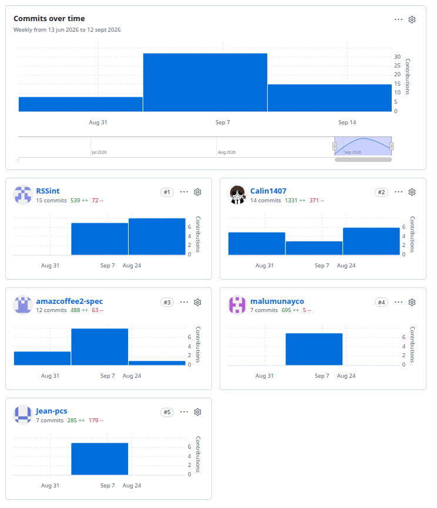
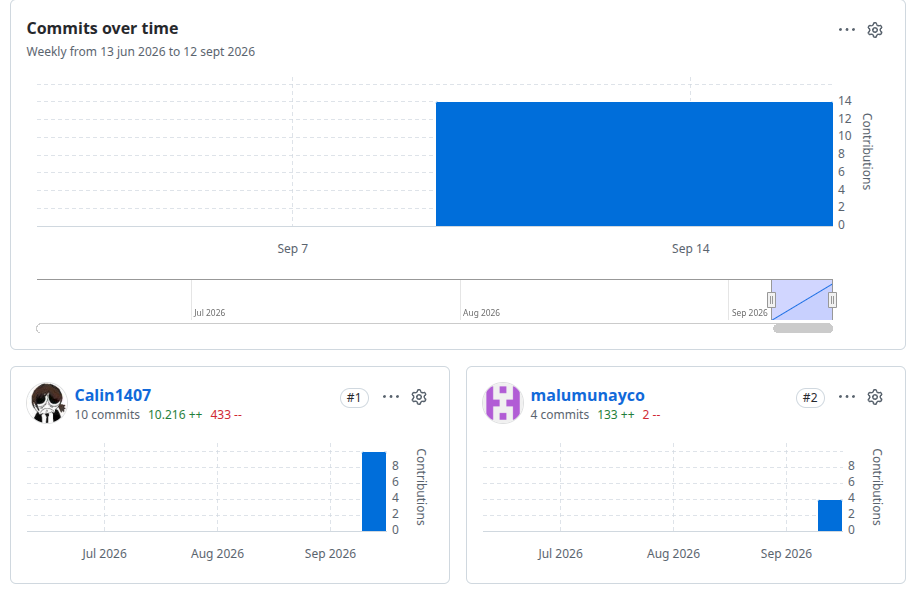

\newpage
# Registro de informe

| Version | Fecha      | Autor                            | Descripcion de avance                                 |
|---------|------------|----------------------------------|-------------------------------------------------------|
| 0.0.1   | 30/08/2026 | Retuerto Rodriguez, Jorge Manuel | Descripcion de StartUp y producto.                    |
| 0.0.2   | 02/08/2026 | Retuerto Rodriguez, Jorge Manuel | Descripcion de equipo                                 |
| 0.1.0   | 03/08/2026 | Retuerto Rodriguez, Jorge Manuel | Lean Ux Proccess y cierre de Chapter 1                |
| 0.1.1   | 06/08/2026 | Condor Sandoval, Jean Pierre     | User Stories                                          |
| 0.2.0   | 07/08/2026 | Condor Sandoval, Jean Pierre     | Impact Mapping, Product Backlog y cierre de Chapter 3 |
| 0.3.0   | 08/08/2026 | Silva Hualpa, Rosangela Karen    | Style guidelines y desarrollo de Mockups de web       |
| 0.4.0   | 18/08/2026 | Santos Minaya, Renzo Peiro       | Analisis de competidores, Needfinding y big picture   |
| 0.5.0   | 18/08/2026 | Munayco Apolaya, Maria Luisa     | Informe de configuracion de Software y sprint 1       |
| 0.5.1   | 19/08/2026 | Retuerto Rodriguez, Jorge Manuel | Rediseño de model c4                                  |
| 0.6.0   | 19/08/2026 | Retuerto Rodriguez, Jorge Manuel | Cierre de capitulo V con evidencias tv1               |
| 1.0.0   | 19/08/2026 | Retuerto Rodriguez, Jorge Manuel | Cierre de informe para entrega tv1                    |

\newpage

# Project Collaboration Insights

Esta sección detalla cómo el equipo colaboró para construir el Final Project 
Documentation Report del producto CultivaTech, mostrando evidencia de trabajo 
conjunto mediante commits, revisiones, herramientas de organización y resultados 
integrados en el informe final. Se refleja la contribución de cada integrante en la 
planificación, desarrollo, documentación y presentación de la solución.

[Repositorio de la organizacion GreenDream](https://github.com/OpenSource-GreenDream){witdh=500px}

- Informe

{witdh=500px}

- Landing Page

{witdh=500px}