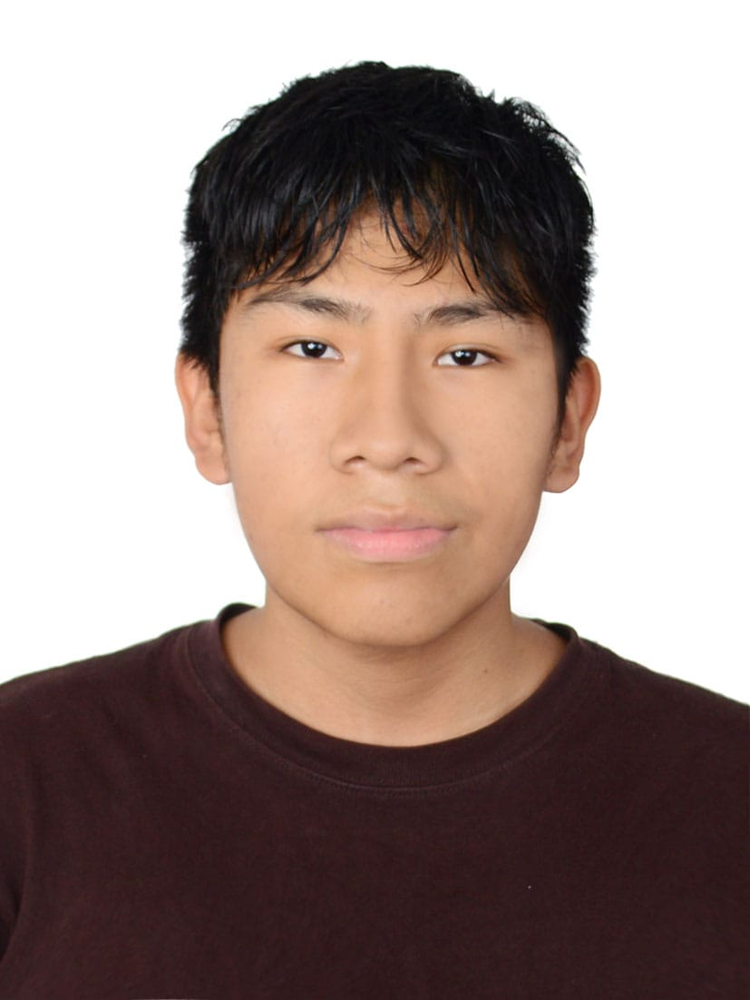
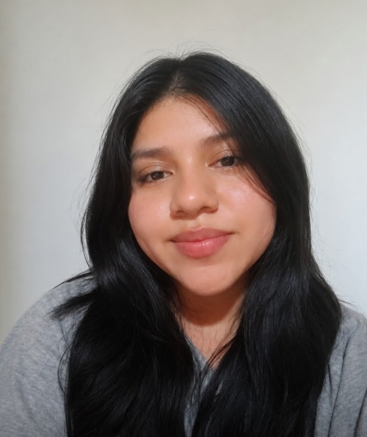
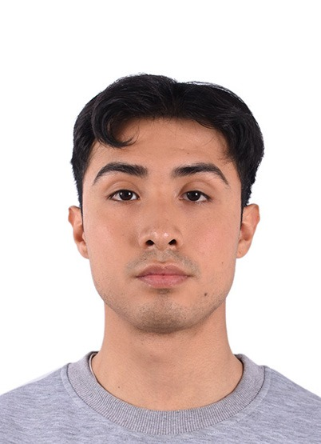
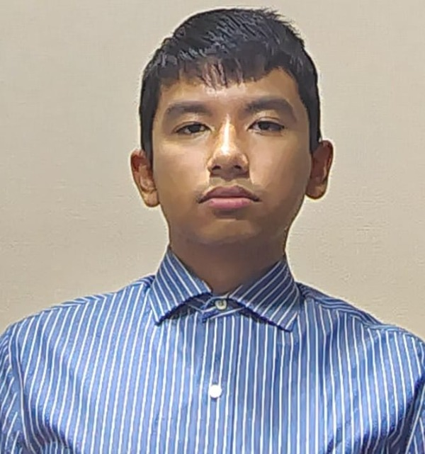

# Capítulo I: Introducción

## 1.1. Startup Profile.

## 1.1.1. Descripción de la Startup.

GreenDream es una StartUp dirigida a solucionar los problemas dentro del sector de la agricultura en el Perú, usando soluciones tecnológicas. Actualmente, tras detectar los desafíos que sufren los agricultores por el cambio climatico hemos desarrollado nuestro producto CultivaTech: una solución que permite el control de las tierras de cultivo con información recolectada de dispositivos IoT. Asimismo, la aplicación analizará los datos entregados y, considerando el historial de anteriores cosechas, permitirá al agricultor conocer la proyección de cosechas futuras.

**Misión:**

Buscamos soluciones innovadores y sostenibles en el medio ambiente que transformen la calidad de trabajo en el sector agrícola y que reduzca el impacto en el medio ambiente, optimizando el uso de recursos y máximizando utilidades, con la finalidad de mejorar la calidad de vida de nuestros clientes.

**Visión:**

Ser líderes en tecnológia dirigida al sector agricola y ampliar nuestro segmento a mayores industrias. Asimismo, obtener el reconocimiento internacional por soluciones efectivas, sostenibles y de alta eficiencia.

## 1.1.2. Perfiles de integrantes del equipo.

| Foto                                                         | Apellido y nombre                                   | Descripcion                                                                                                                                                                                                                                                                                                                                                                                                                                                                                                               |
|:---:|:---|:---|
| {width=5cm}    | Condor Sandoval, Jean Pierre                        | Mi nombre es Jean Pierre Condor Sandoval, tengo 19 años y actualmente curso el 6to ciclo de la carrera de Ingeniería de Software en la Universidad Peruana de Ciencias Aplicadas (UPC). Mis conocimientos y habilidades están orientados principalmente al desarrollo Front End, utilizando tecnologías modernas para la creación de interfaces web dinámicas, intuitivas y enfocadas en la experiencia del usuario.                                                                                                      |
| {width=5cm}  | Munayco Apolaya, Maria Luisa                        | Mi nombre es María Luisa Munayco Apolaya y soy estudiante de Ingeniería de Software en la Universidad Peruana de Ciencias Aplicadas (UPC). Me interesa seguir desarrollando mis habilidades en tecnología y participar en proyectos que me permitan adquirir experiencia, aportar mis conocimientos y crear soluciones de software junto a mi equipo.                                                                                                                                                                     |
| {width=5cm}  | Santos Minaya, Renzo Peiro                          | Mi nombre es Renzo Piero Santos Minaya, soy estudiante del 6to ciclo de la carrera de Ingeniería de Software en la Universidad Peruana de Ciencias Aplicadas. A largo plazo mis metas son desarrollar habilidades en gestión de software y business management con software development. Crecer profesionalmente en mi país o en el extranjero.                                                                                                                                                                           |
| {width=5cm}  | Retuerto Rodriguez, Jorge Manuel                    | Mi nombre es Jorge Manuel Retuerto Rodríguez, tengo 21 años y estoy cursando el 7to ciclo de la carrera de Ingeniería de Software en la Universidad Peruana de Ciencias Aplicadas. Mi conocimiento y habilidades son enfocadas al desarrollo Back End con tecnologias de alta competencia como C# y Java. Me haré responsable de la comunicación del grupo, planificación y desarrollo junto a mi equipo.                                                                                                                 |
| {width=5cm}  | Silva Hualpa, Rosangela Karen                       | Mi nombre es Rosangela Silva y estoy cursando la carrera de Ingeniería de Software en la Universidad Peruana de Ciencias Aplicadas. Tengo interés en seguir desarrollándome en el área de tecnología y adquirir experiencia a través de la participación en diferentes proyectos. Me gustaría enfocarme en el desarrollo y la creación de soluciones de software, aportando mis conocimientos, aprendiendo junto a mi equipo y asumiendo responsabilidades que contribuyan al cumplimiento de los objetivos del proyecto. |

## 1.2. Solution Profile.

Nuestro producto CultivaTech es una solución diseñada pra el sector agricola, responde a las dificultades climaticas actuales y aplicamos soluciones con dispositivos IoT junto al análisis predictivo.

Como objetivo tenemos actualizar la manera en la que se gestiona los campos de cultivo, integrando tecnológia en la tierra para aumentar la precisión: conociendo la fertilidad, nivel de ácidez, nutrientes y húmedad. Además, usando el análisis predictivo, aumentaremos el rendimiento de las tierras, máximizando las utilidades en las cosechas y su rentabilidad.

## 1.2.1 Antecedentes y problemática.