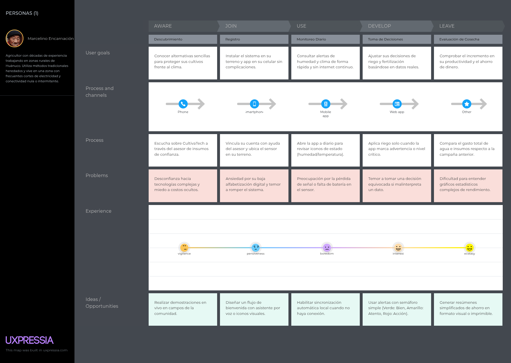
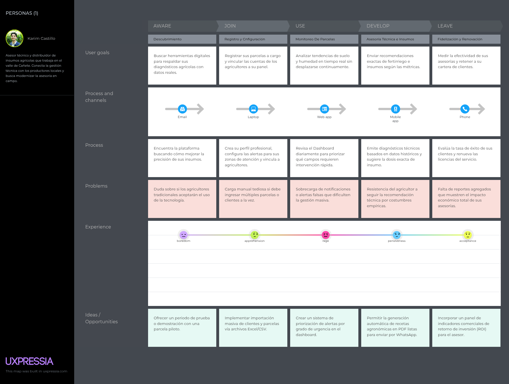
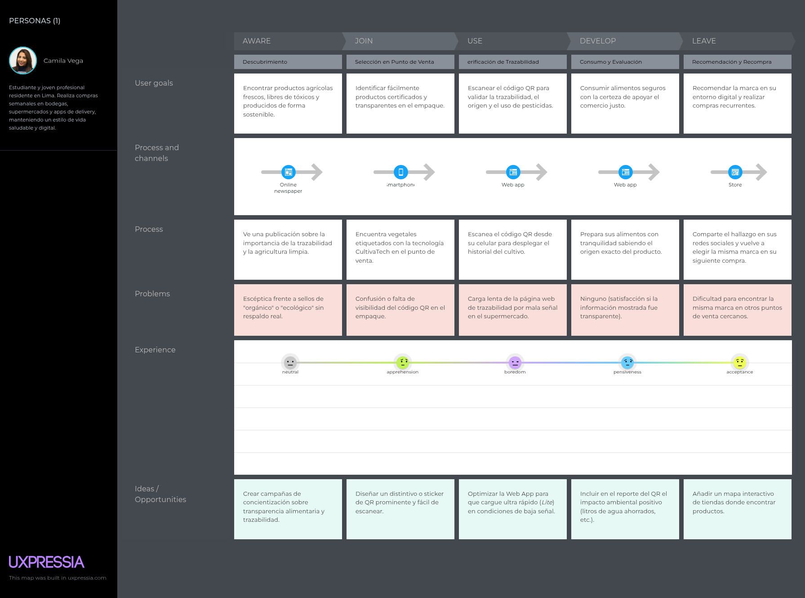
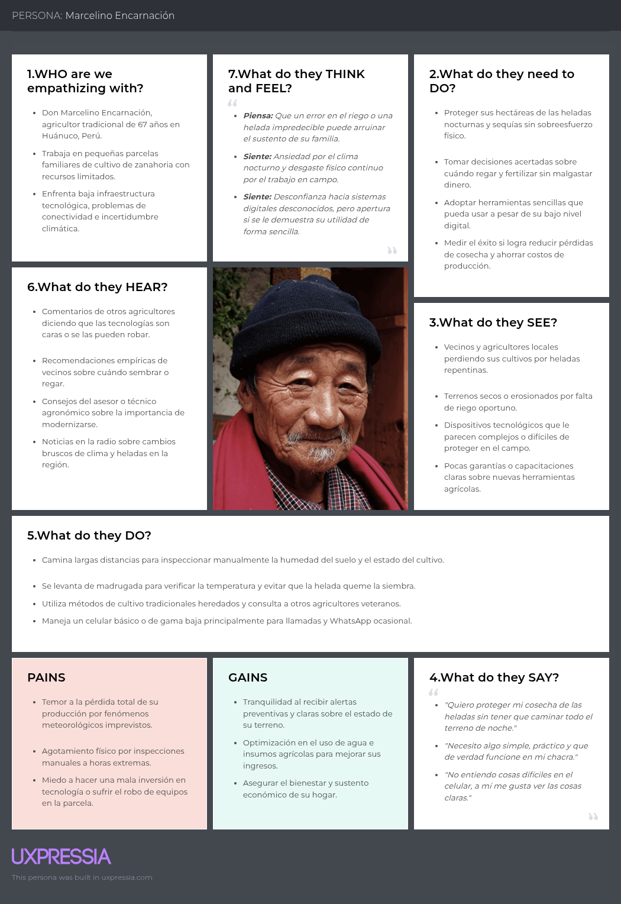
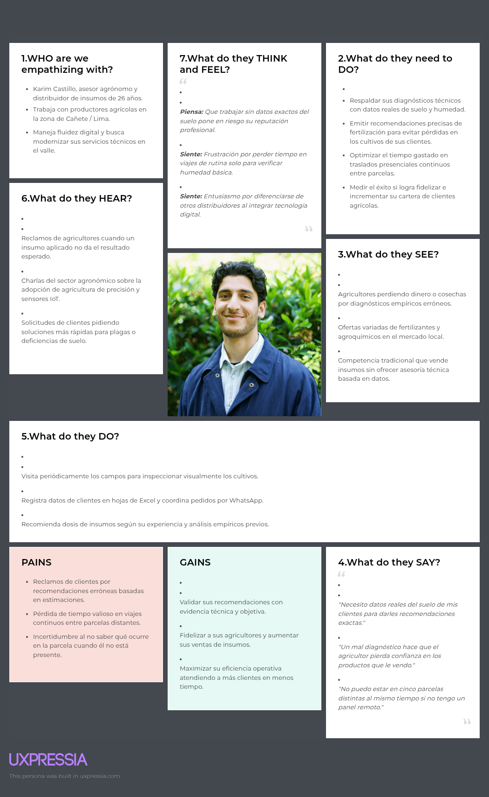
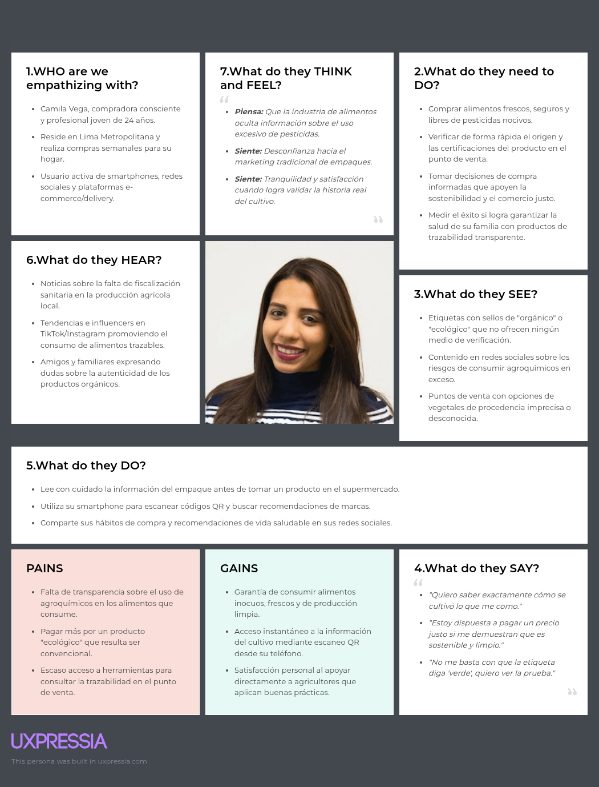

## 2.3. Needfinding.

A continuación se presentan los tres User Personas representativos de los segmentos objetivo definidos a partir de la síntesis de hallazgos de las entrevistas y el análisis cualitativo-estadístico.

### 2.3.1. User Personas.
A continuación, se presentan las fichas de User Persona elaboradas en UXPressia para cada uno de los tres segmentos objetivo. Cada ficha integra los hallazgos de las entrevistas, incluyendo características demográficas, personalidad, habilidades, marcas e influencias, dispositivos de preferencia y canales de interacción.

* **Segmento 1: Agricultor**
  
{width=300px}

\newpage

* **Segmento 2: Proveedor**
    
{width=300px}

\newpage

* **Segmento 3: Consumidor**
    
{width=300px}

\newpage

### 2.3.2. User Task Matrix.
La User Task Matrix (Matriz de Tareas del Usuario) mapea las tareas clave que realiza cada segmento de usuario objetivo frente a la solución. Se analizan según su frecuencia de ejecución y la importancia estratégica que representan para cumplir las metas descritas en los User Personas.

| Tarea | Agricultor (Frecuencia / Importancia) | Proveedor (Frecuencia / Importancia) | Cliente Final (Comprador) (Frecuencia / Importancia) |
| :--- | :---: | :---: | :---: |
| **Monitorear el estado del suelo (humedad, nutrientes)** | Alta / Alta | Media / Alta | Baja / Baja |
| **Recibir alertas en tiempo real sobre condiciones críticas** | Alta / Alta | Media / Media | Baja / Media |
| **Revisar datos históricos y tendencias del cultivo** | Media / Media | Alta / Alta | Baja / Baja |
| **Generar reportes de rendimiento y sostenibilidad** | Baja / Media | Media / Media | Baja / Alta |
| **Registrar y gestionar productos en inventario** | Baja / Media | Alta / Alta | Baja / Baja |
| **Verificar trazabilidad y origen del producto** | Baja / Baja | Baja / Baja | Alta / Alta |
| **Consultar pronóstico del clima para planificar riego** | Alta / Alta | Media / Alta | Baja / Media |

#### Hallazgos clave de la matriz:

* **Agricultores:** Priorizan las tareas operativas diarias en campo (monitoreo de suelo, alertas de heladas y pronóstico del clima) con alta frecuencia e importancia.
* **Proveedores de Insumos:** Se concentran en el análisis de datos históricos, la gestión de inventario y la generación de reportes para respaldar sus recomendaciones agronómicas.
* **Clientes Finales:** Su interacción es altamente puntual pero crítica en el punto de venta, centrada en la verificación de trazabilidad, el origen del producto y los reportes de sostenibilidad.

### 2.3.3. User Journey Mapping.
A continuación, se presenta el User Journey Mapping (Mapa de Experiencia del Usuario) que describe las etapas clave del recorrido de cada segmento objetivo frente a la solución, incluyendo los puntos de contacto, emociones y oportunidades de mejora.

* **Segmento 1: Agricultor**
  El siguiente Journey Map ilustra el proceso que sigue Marcelino, un agricultor de Huánuco, para monitorear el estado de su cultivo de zanahoria y decidir cuándo regar o fertilizar. El recorrido muestra cómo Marcelino depende de métodos tradicionales (inspección visual, experiencia personal) y enfrenta incertidumbre por la falta de datos precisos, especialmente ante cambios climáticos inesperados.

\newpage

* **Segmento 2: Proveedor**
  El siguiente Journey Map muestra el proceso de Karim, un asesor técnico de Cañete, para recomendar insumos a los agricultores. El recorrido evidencia cómo Karim realiza visitas presenciales y se basa en su experiencia, pero carece de datos reales del suelo para hacer recomendaciones precisas, lo que genera errores, pérdida de confianza y reclamos de los agricultores.

\newpage

* **Segmento 3: Cliente Final**
  El siguiente Journey Map describe el proceso de Camila, una consumidora de Lima, para verificar la trazabilidad y sostenibilidad de los productos que compra en el supermercado. El recorrido muestra cómo Camila se enfrenta a información limitada y confusa sobre el origen de los productos, lo que genera desconfianza y frustración al momento de tomar decisiones de compra.
   

\newpage

### 2.3.4. Empathy Mapping.
El Mapa de Empatía sintetiza las observaciones e impresiones recopiladas durante las entrevistas, permitiendo profundizar en los aspectos emocionales y actitudinales de los tres segmentos de usuario objetivo de CultivaTech.

- **Empathy Map 1: Don Marcelino Encarnación (Agricultor Tradicional)**

El siguiente Mapa de Empatía profundiza en la experiencia de Marcelino, el agricultor de Huánuco. Se identifican sus principales pensamientos y sentimientos (incertidumbre ante el clima, preocupación por la pérdida de cosechas), lo que ve en su entorno (campos extensos, cambios climáticos), lo que oye de otros agricultores (consejos tradicionales, temor a la tecnología), lo que dice y hace (inspección manual, decisión por intuición), así como sus principales pains (falta de información precisa, esfuerzo físico) y gains (deseo de certidumbre, mejora de la productividad).

{width=300px}

\newpage

- **Empathy Map 2: Karim Castillo (Proveedor de Insumos)**

El siguiente Mapa de Empatía analiza la experiencia de Karim, el asesor técnico. Se exploran sus pensamientos y sentimientos (frustración por recomendaciones erróneas, necesidad de credibilidad), lo que ve (agricultores con problemas de suelo, competencia), lo que oye (reclamos de agricultores, feedback de otros asesores), lo que dice y hace (visitas a campo, recomendaciones basadas en experiencia), y sus pains (falta de datos precisos, pérdida de clientes) y gains (deseo de fidelizar clientes, incrementar ventas con recomendaciones acertadas).

{width=300px}

\newpage

- **Empathy Map 3: Camila Vega (Consumidora Final)**

El siguiente Mapa de Empatía se centra en la experiencia de Camila, la consumidora final. Se identifican sus pensamientos y sentimientos (deseo de transparencia, desconfianza por falta de información), lo que ve (etiquetas confusas, productos de origen desconocido), lo que oye (tendencias de alimentación saludable, testimonios de otros compradores), lo que dice y hace (búsqueda en Google, decisión por precio y apariencia), y sus pains (dificultad para verificar origen, falta de confianza) y gains (deseo de productos saludables, disposición a pagar premium por trazabilidad).

{width=300px}

\newpage