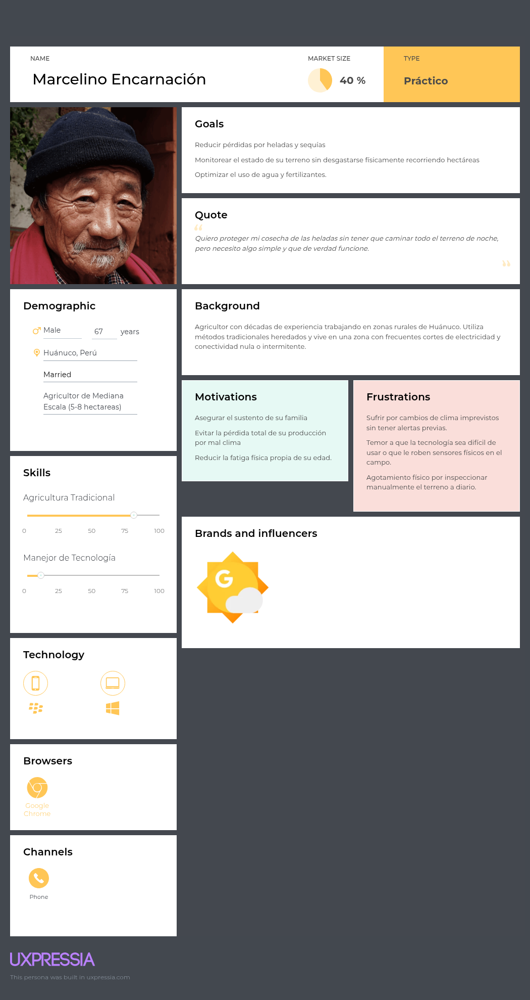
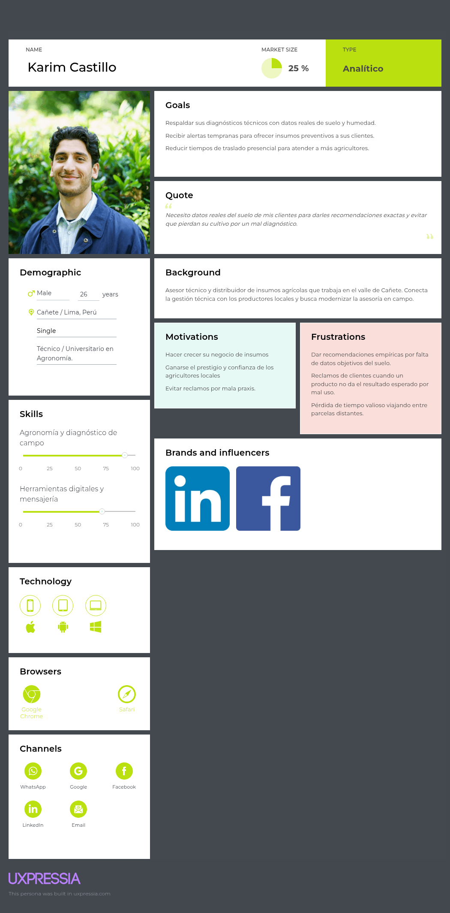
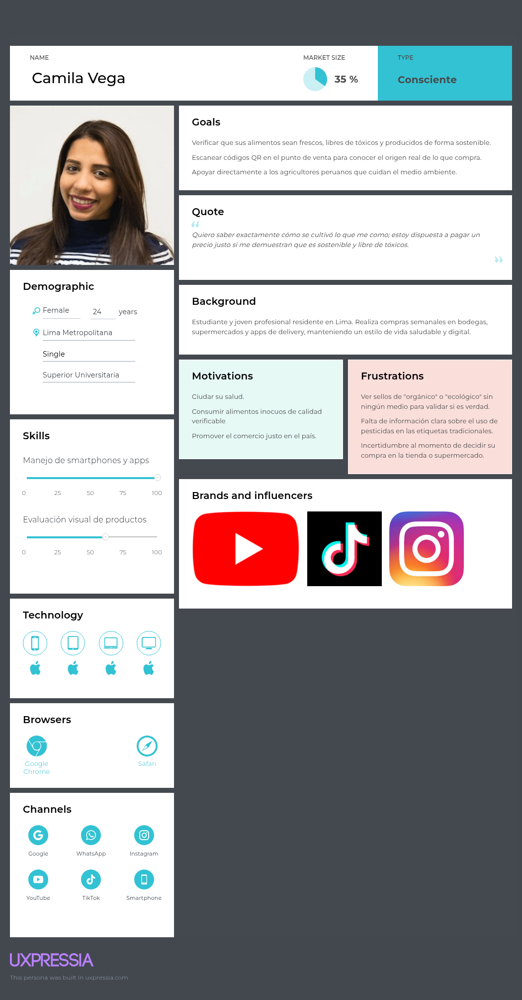

## 2.3. Needfinding.
A continuación se presentan los tres User Personas representativos de los segmentos objetivo definidos a partir de la síntesis de hallazgos de las entrevistas y el análisis cualitativo-estadístico.

### 2.3.1. User Personas.
A continuación, se presentan las fichas de User Persona elaboradas en UXPressia para cada uno de los tres segmentos objetivo. Cada ficha integra los hallazgos de las entrevistas, incluyendo características demográficas, personalidad, habilidades, marcas e influencias, dispositivos de preferencia y canales de interacción.

* **Segmento 1: Agricultor**
  

* **Segmento 2: Proveedor**
    

* **Segmento 3: Consumidor**
    

### 2.3.2. User Task Matrix.

### 2.3.3. User Journey Mapping.

### 2.3.4. Empathy Mapping.