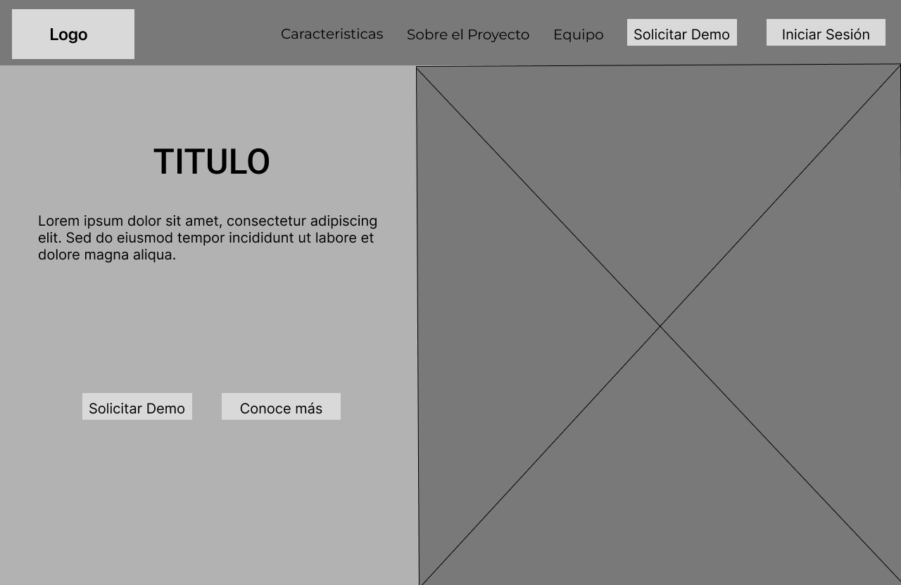
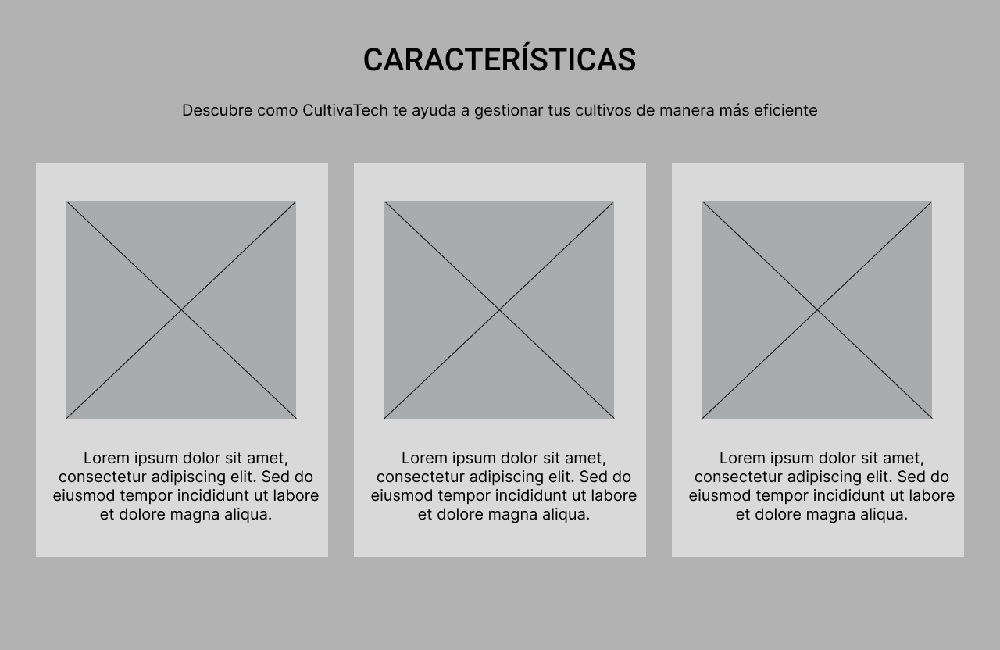
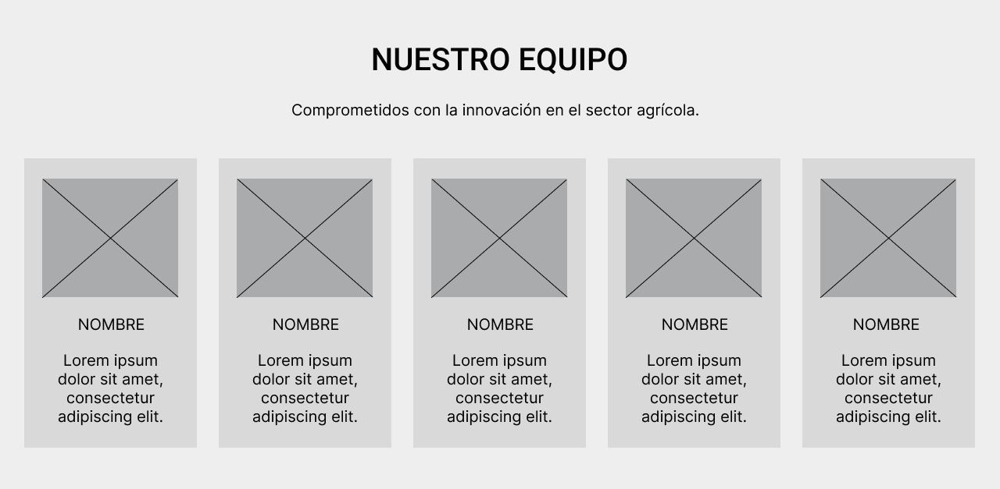
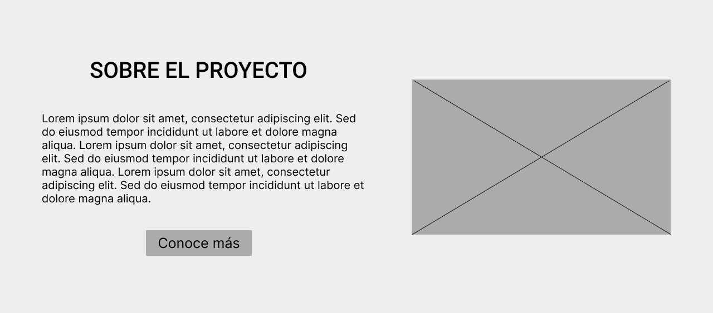
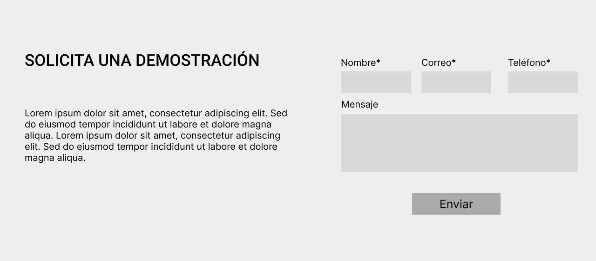
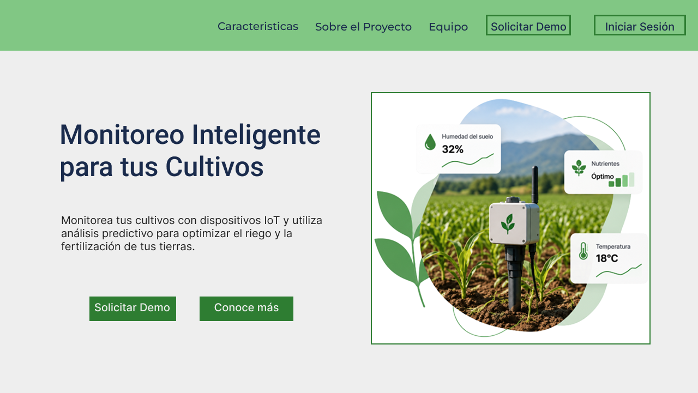
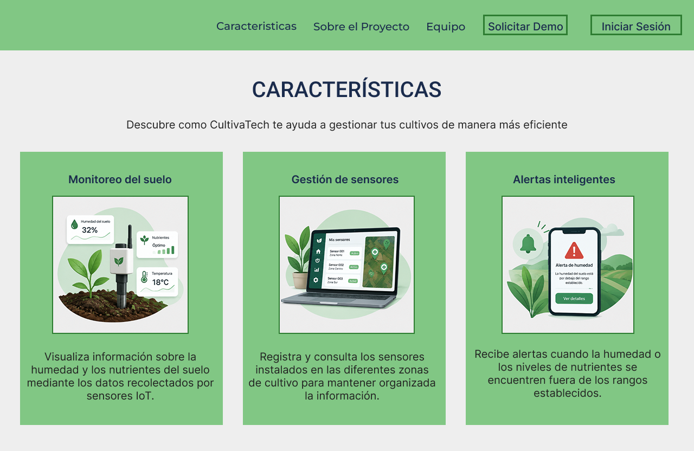
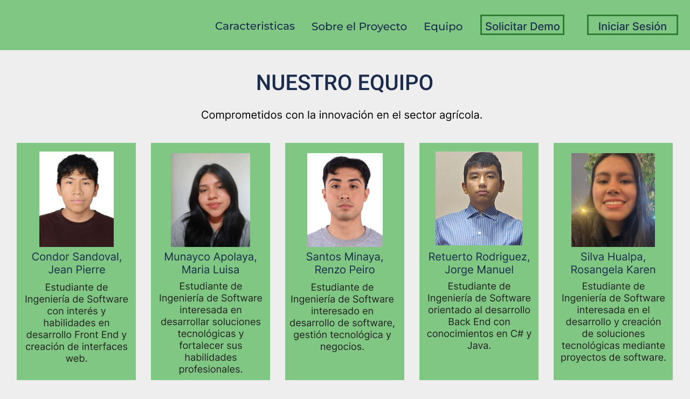
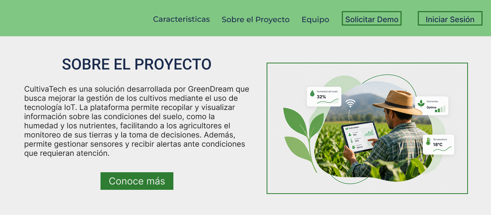
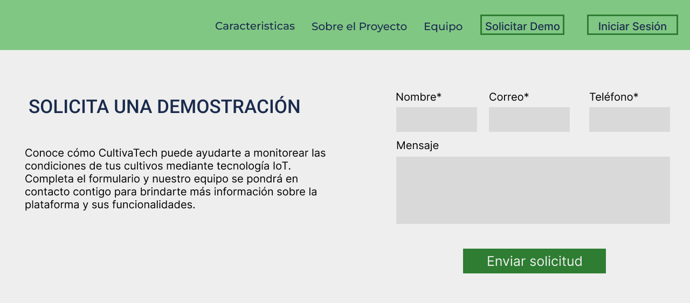

## 4.3. Landing Page UI Design.

La Landing Page de CultivaTech estará diseñada para presentar de manera clara y atractiva la solución, sus principales características, el proyecto y el equipo. Contará con una navegación sencilla, manteniendo la identidad visual de CultivaTech y un diseño responsivo para computadoras y dispositivos móviles.

## 4.3.1. Landing Page Wireframe.
**Landing Page para Desktop Browser**

Boceto estructural de la sección principal (Hero Section), definiendo un diseño de dos columnas para ubicar la propuesta de valor a la izquierda y un elemento visual destacado a la derecha.

Diseño esquemático (layout) para la sección de características de la plataforma, utilizando un sistema de cuadrícula para distribuir equitativamente tres tarjetas informativas.

Diseño esquemático de la sección Nuestro Equipo, organizando en tarjetas individuales la información de los integrantes de GreenDream.

Diseño estructural de la sección Sobre el Proyecto, distribuyendo la descripción de CultivaTech y un elemento visual representativo de la solución.

Diseño esquemático de la sección Solicita una Demostración, incorporando un formulario para que los usuarios interesados puedan ingresar sus datos de contacto y enviar una solicitud.

## 4.3.2. Landing Page Mock-up.
Interfaz final de la sección principal (Hero Section) de CultivaTech. Presenta la propuesta de valor de la plataforma mediante un diseño de dos columnas, combinando información sobre el monitoreo inteligente de cultivos con una representación visual del uso de sensores IoT.

Implementación final de la sección Características. Presenta las principales funcionalidades de CultivaTech: monitoreo del suelo, gestión de sensores y alertas inteligentes, organizadas mediante tarjetas informativas para facilitar su comprensión.

Resultado visual de la sección Nuestro Equipo. Presenta a los cinco integrantes de GreenDream mediante tarjetas individuales que incluyen fotografía, nombre y una breve descripción de cada miembro.

Diseño final de la sección Sobre el Proyecto. Explica brevemente el propósito de CultivaTech y su aplicación de tecnología IoT para el monitoreo de cultivos, complementando la información con un elemento visual relacionado con la solución propuesta.

Implementación final de la sección Solicita una Demostración. Incluye un formulario con campos de nombre, correo, teléfono y mensaje, permitiendo que los usuarios interesados envíen una solicitud para obtener mayor información sobre CultivaTech.

