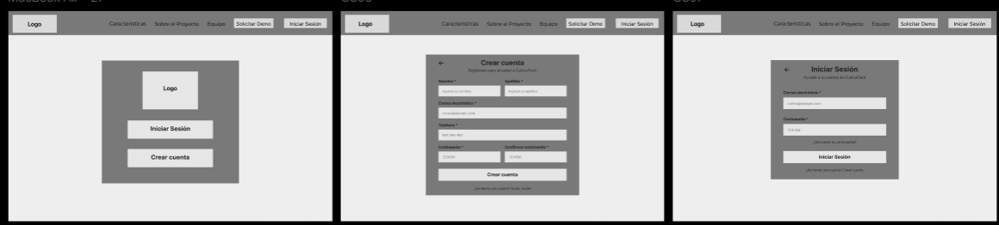
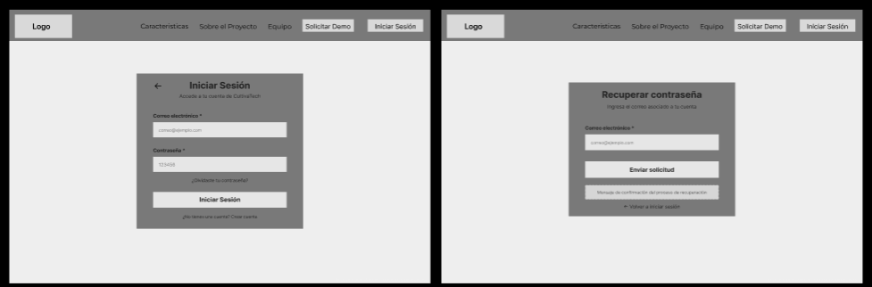
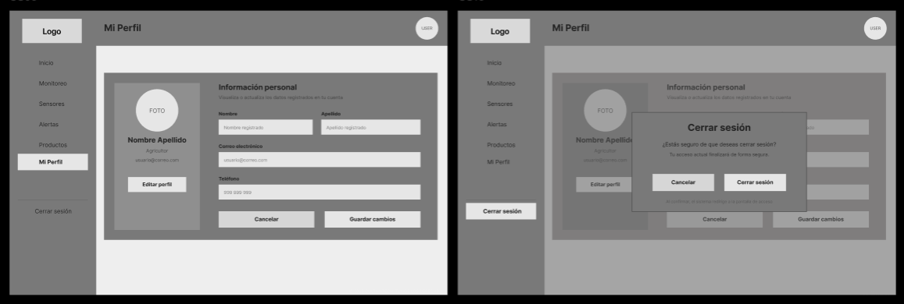
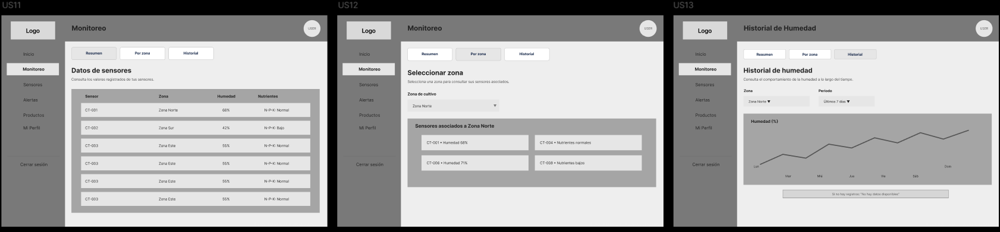
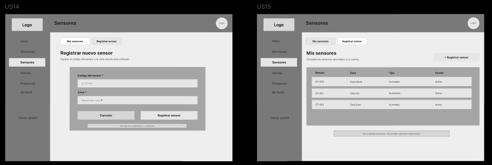
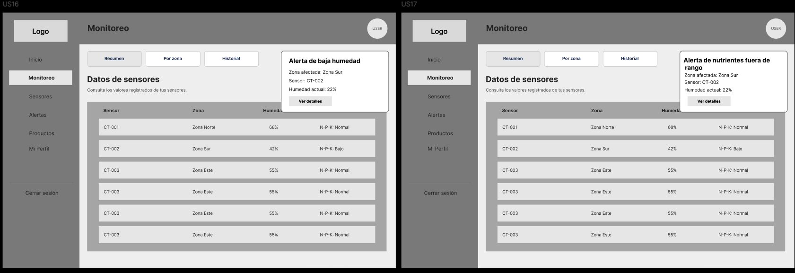
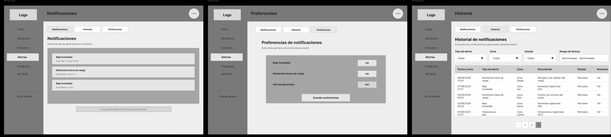
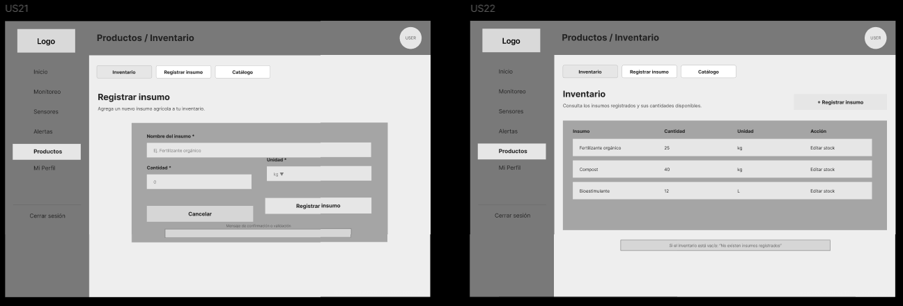
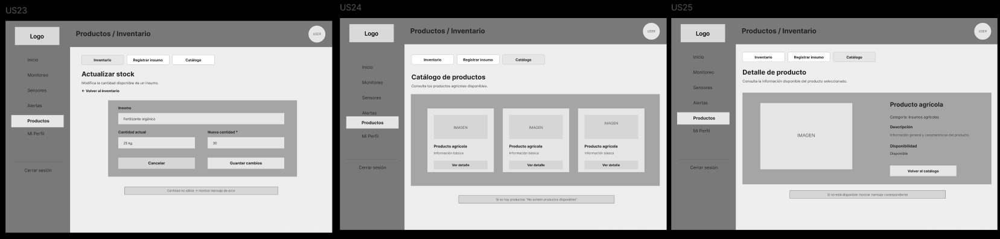

## 4.4. Web Applications UX/UI Design.

El diseño de experiencia de usuario (UX) y de interfaz de usuario (UI) de CultivaTech busca ofrecer una plataforma intuitiva, accesible y funcional para agricultores. La UX se enfoca en facilitar tareas como el monitoreo de las condiciones del suelo, la gestión de sensores, la consulta de alertas y notificaciones, y el control de productos e inventario mediante flujos de navegación simples y organizados. Por su parte, la UI mantiene una identidad visual coherente con CultivaTech, utilizando una estructura clara que facilita la visualización de información como humedad, nutrientes y estado de los sensores. En conjunto, el diseño UX/UI busca transformar los datos obtenidos mediante dispositivos IoT en información comprensible que permita al agricultor supervisar sus cultivos y tomar decisiones de manera rápida y eficiente.

## 4.4.1. Web Applications Wireframes.

Los siguientes wireframes presentan el flujo inicial de acceso a CultivaTech. La primera pantalla funciona como punto de entrada a la plataforma, permitiendo al usuario seleccionar entre iniciar sesión o crear una nueva cuenta. A partir de esta vista, el usuario puede acceder al formulario de registro (US06), donde ingresa sus datos personales y credenciales, o dirigirse al inicio de sesión (US07) para acceder a las funcionalidades de la aplicación.

Estos wireframes representan el proceso de recuperación de contraseña (US08). Desde la pantalla de inicio de sesión, el usuario puede seleccionar la opción “¿Olvidaste tu contraseña?” e ingresar el correo electrónico asociado a su cuenta. El sistema inicia el proceso de recuperación e informa al usuario que la solicitud ha sido enviada correctamente.

Los siguientes wireframes representan la gestión del perfil y el cierre de sesión en CultivaTech. La visualización y edición del perfil (US09) permite al agricultor consultar su información personal registrada, modificar sus datos y guardar los cambios realizados. Por otro lado, el cierre de sesión (US10) permite al usuario finalizar su sesión de manera segura; al seleccionar la opción “Cerrar sesión”, el sistema muestra una ventana de confirmación y, al confirmar la acción, finaliza la sesión y redirige al usuario a la pantalla de acceso.

Los siguientes wireframes corresponden al módulo de monitoreo de CultivaTech. La vista de resumen (US11) permite consultar los datos registrados por los sensores, mostrando información como zona, humedad y estado de nutrientes. La vista por zona (US12) permite seleccionar una zona de cultivo específica y consultar los sensores asociados. Finalmente, el historial de humedad (US13) permite analizar la evolución de esta variable durante un periodo determinado.

Estos wireframes representan la gestión de sensores de CultivaTech. El registro de un nuevo sensor (US14) permite ingresar el código del dispositivo y asociarlo con una zona de cultivo. Por otro lado, la consulta de sensores registrados (US15) presenta una lista organizada con información relevante de cada dispositivo y su estado dentro del sistema.

Los siguientes wireframes representan las alertas automáticas generadas por CultivaTech. La alerta por baja humedad (US16) aparece cuando un sensor registra un valor inferior al rango establecido, identificando la zona y el sensor afectado. De manera similar, la alerta por nutrientes fuera de rango (US17) informa al agricultor cuando los valores registrados presentan condiciones que requieren atención.

Estos wireframes corresponden al módulo de notificaciones. La consulta de notificaciones (US18) permite visualizar las alertas actualmente generadas por el sistema. Las preferencias de notificaciones (US19) permiten seleccionar qué tipos de alertas desea recibir el agricultor. Finalmente, el historial de notificaciones (US20) presenta los registros anteriores, incorporando filtros por tipo de alerta, zona, estado y rango de fechas.

Los siguientes wireframes representan el módulo de Productos e Inventario. El registro de insumos (US21) permite incorporar nuevos recursos utilizados en la actividad agrícola indicando información como nombre, cantidad y unidad. La consulta del inventario (US22) organiza los insumos registrados y muestra su disponibilidad actual.

Finalmente, estos wireframes complementan la gestión de Productos e Inventario. La actualización de stock (US23) permite modificar la cantidad disponible de un insumo previamente registrado. El catálogo (US24) presenta los productos agrícolas disponibles mediante tarjetas visuales, mientras que el detalle de producto (US25) permite consultar información específica del elemento seleccionado.

## 4.4.2. Web Applications Wireflow Diagrams.

## 4.4.2. Web Applications Mock-ups.

## 4.4.3. Web Applications User Flow Diagrams.
