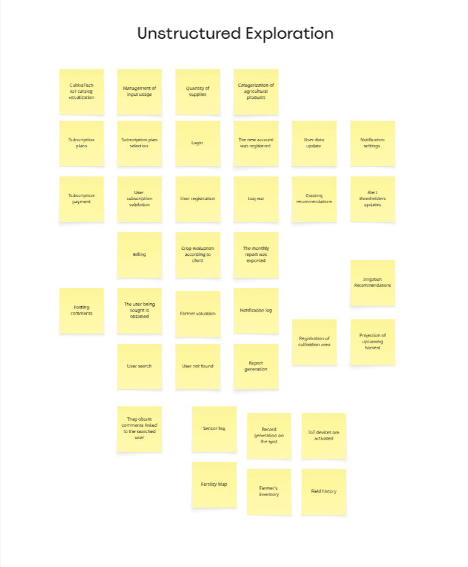
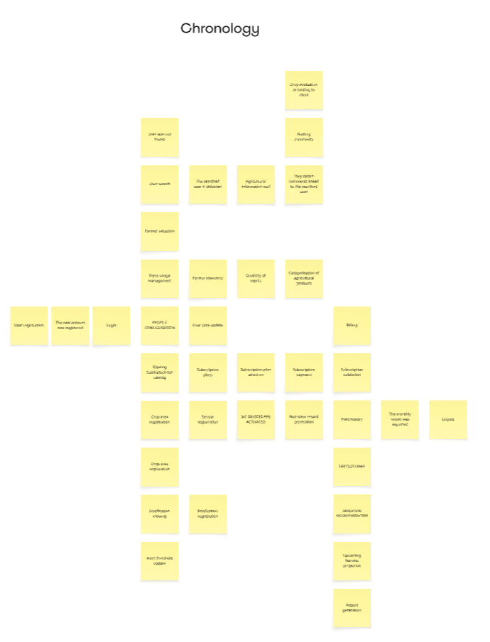
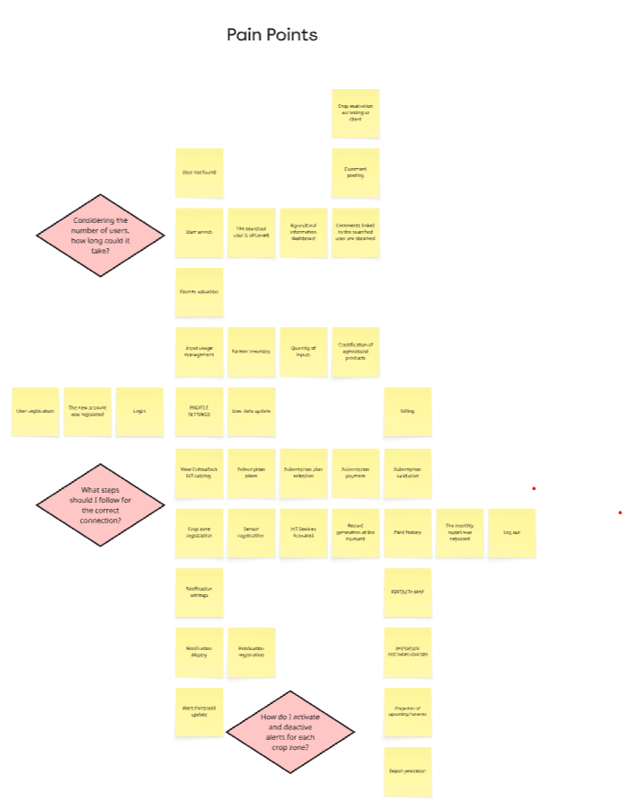
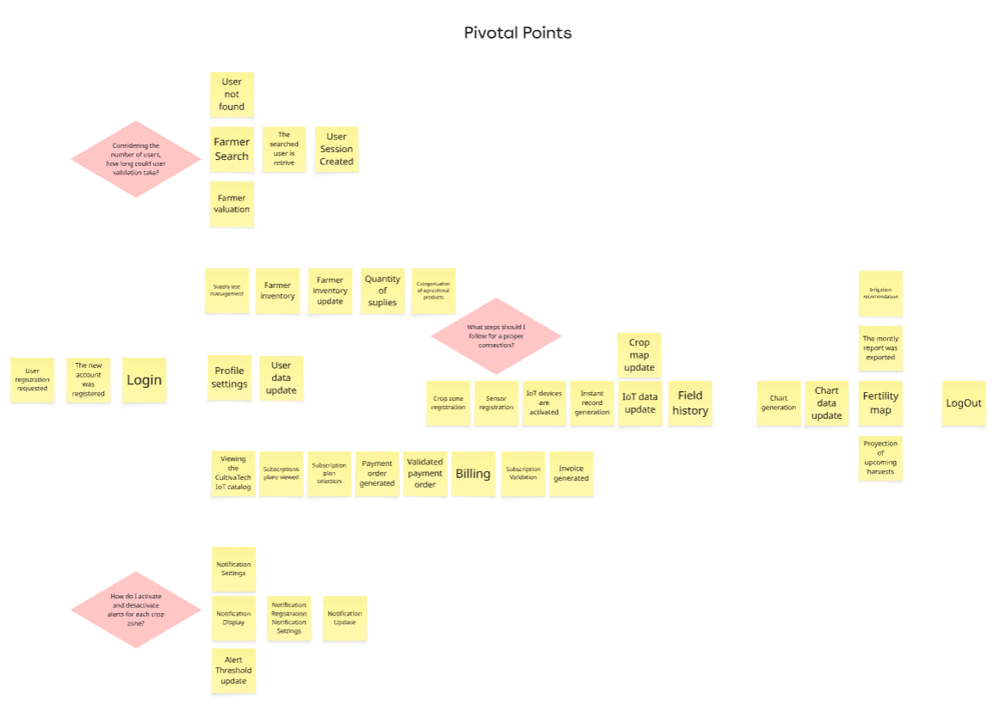
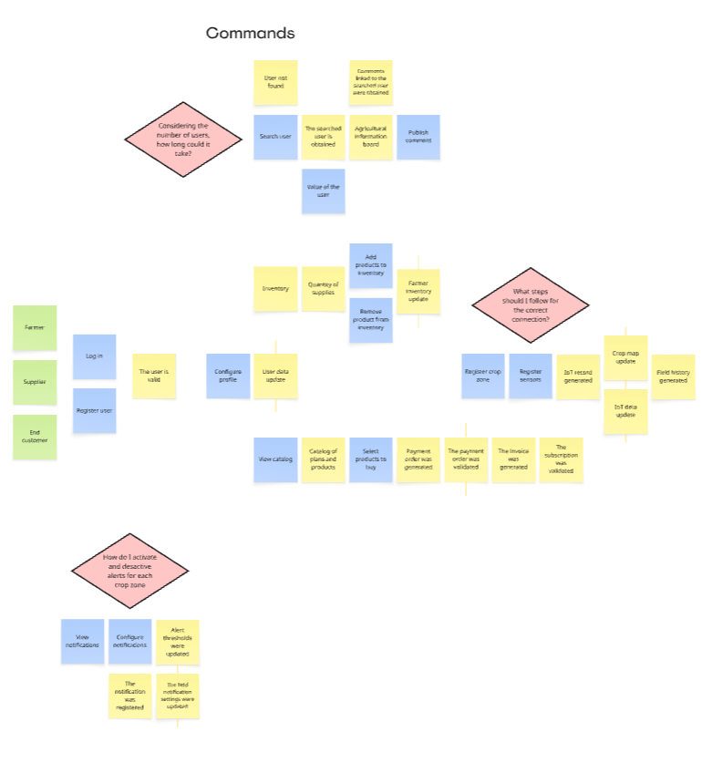
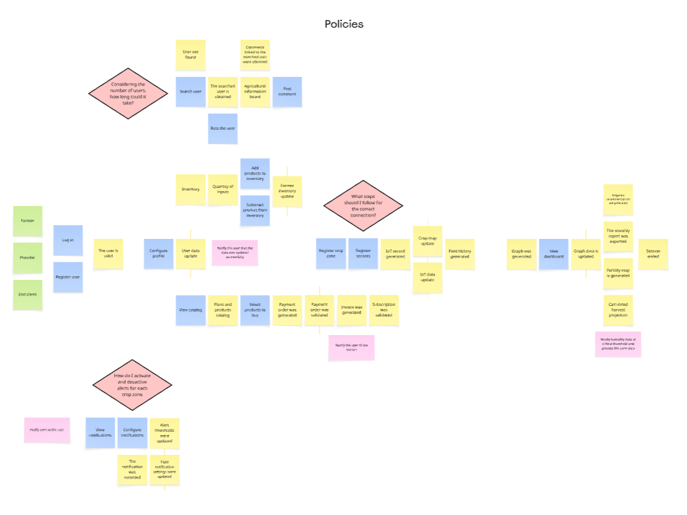
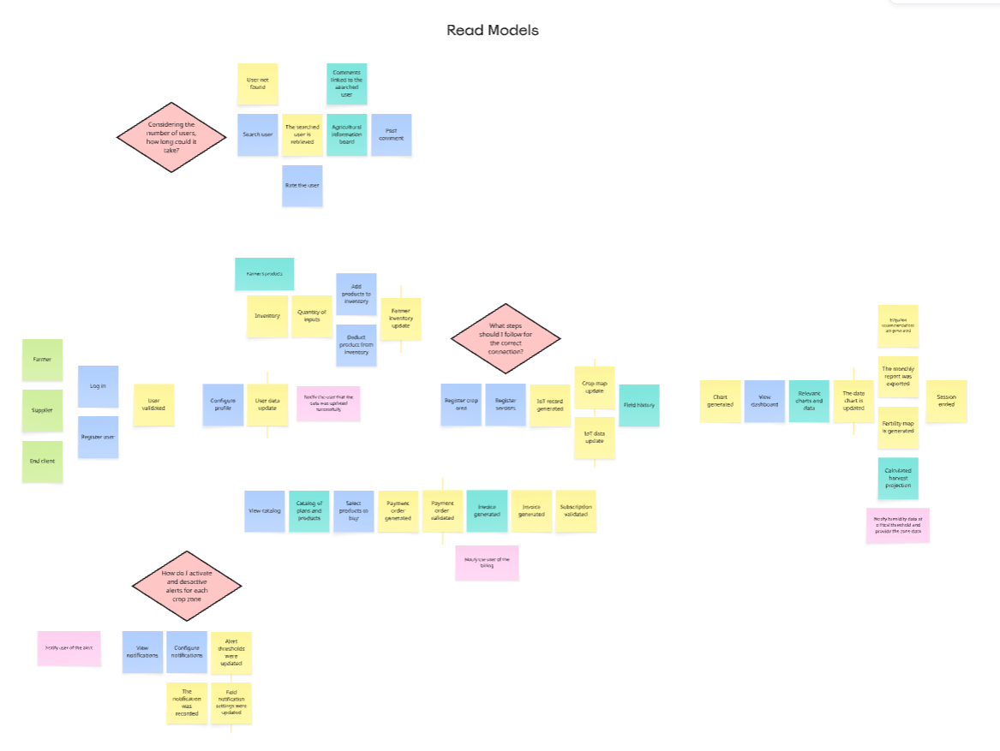
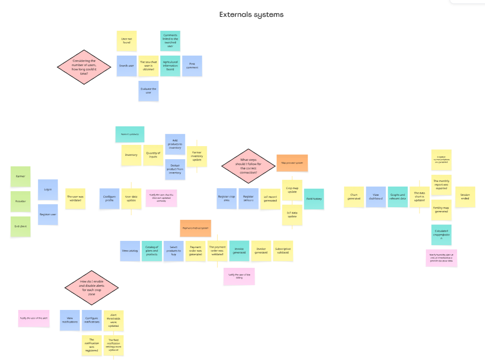
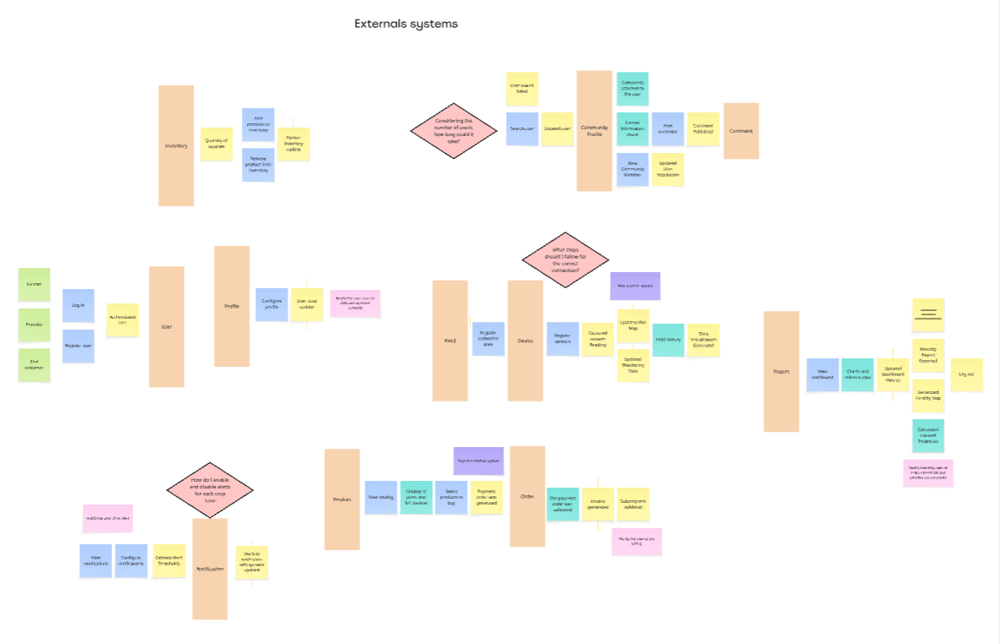
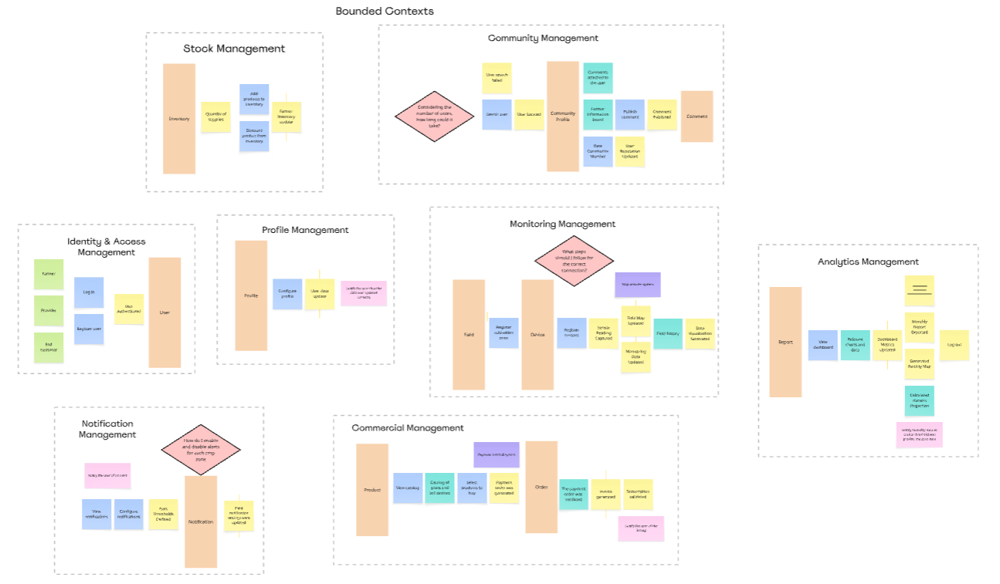

## 4.6. Domain-Driven Software Architecture.

## 4.6.1. Design-Level Event Storming.
Para definir la arquitectura de CultivaTech orientada al dominio (DDD), se llevó a cabo un proceso iterativo de Design-Level Event Storming siguiendo la metodología de 10 pasos. Este análisis nos permitió alinear la lógica del negocio agrícola con la implementación tecnológica. A continuación, se detalla la evolución del modelo:

**Step 1: Unstructured Exploration**

Durante esta fase inicial, se identificaron y representaron cronológicamente todos los eventos que modifican el estado dentro del ecosistema de la plataforma. Estos eventos fueron redactados en tiempo pasado (representados simbólicamente en post-its naranjas), cubriendo el flujo completo desde la interacción del hardware hasta la analítica de datos. Entre los eventos más relevantes identificados se encuentran:

**Step 2: Chronology**

Se ordenaron los eventos del dominio de forma cronológica de izquierda a derecha, estableciendo el flujo del ciclo de vida del monitoreo agrícola.

**Step 3: Pain Points**

Se identificaron los puntos críticos y riesgos técnicos del negocio mediante rombos rosas, enfocándose en desafíos como la determinación exacta de dispositivos necesarios por zona de cultivo, la simplificación de procesos para evitar pasos innecesarios y la optimización de los reportes para que entreguen solo datos de alto valor. Asimismo, se cuestionó la fiabilidad del historial frente a irregularidades del terreno para asegurar que las proyecciones de cosecha sean precisas y útiles para el agricultor.

**Step 4: Pivotal Points**

Se definieron los eventos pivote que marcan cambios significativos en el estado del sistema, dividiendo el flujo en fases claras: el Registro de cuenta y el Pago de suscripción como hitos iniciales, seguidos por la Activación de dispositivos IoT que da inicio al monitoreo, y finalmente la Generación de reportes y Proyección de cosechas, que consolidan la entrega de valor predictivo para el agricultor.

**Step 5: Commands**

Se identificaron los comandos (post-its azules) que representan las intenciones de los usuarios para provocar cambios en el sistema, junto con los actores (post-its amarillos) responsables de ejecutarlos. Los actores principales definidos son el Agricultor, el Proveedor y el Cliente final, quienes interactúan mediante acciones clave como Registrar usuario, Seleccionar plan de suscripción, Registrar zona de cultivo y Exportar reporte.

**Step 6: Policies**

Se incorporaron las reglas de negocio reactivas (post-its lilas) que automatizan la respuesta del sistema ante eventos específicos. Entre las políticas definidas destacan la Verificación de datos válidos tras el inicio de sesión, la validación del Seguro vigente al realizar el pago, y la automatización de alertas cuando se superan los umbrales de humedad o nutrientes en el historial de campo.

**Step 7: Read Models**

Se mapearon los Read Models (post-its verdes), que representan las vistas e interfaces de datos necesarias para que los actores tomen decisiones informadas. Entre los modelos de lectura clave se encuentran la Lista de planes disponibles, la Búsqueda de usuarios, el Estado del sensor en tiempo real y el Dashboard de indicadores del campo, los cuales permiten al agricultor visualizar la información crítica antes de ejecutar cualquier comando de gestión o riego.

**Step 8: External Systems**

Se identificaron los sistemas externos (post-its rosados rectangulares) que interactúan con CultivaTech para completar el flujo de procesos. Entre ellos destacan el Sistema de métodos de pago para procesar las suscripciones de los usuarios y el Sistema de mapas (como Google Maps o Mapbox), indispensable para la geolocalización de las zonas de cultivo y la visualización de los indicadores sobre el terreno.

**Step 9: Aggregates**

Se incrementó el nivel de abstracción agrupando los comandos, eventos y reglas de negocio alrededor de las entidades principales del dominio (Aggregates, representados en post-its amarillos grandes). Para CultivaTech, se definieron agregados clave como Usuario, Plan de Suscripción, Notificaciones, Zona, IoT y Report, los cuales encapsulan la lógica y aseguran la consistencia del estado del sistema en cada etapa del monitoreo agrícola.

**Step 10: Bounded Contexts**

Finalmente, se delimitaron los límites semánticos y transaccionales del dominio mediante la definición de Bounded Contexts, agrupando los agregados y procesos relacionados en bloques independientes. Para CultivaTech, la arquitectura se consolidó en tres contextos principales: IAM (Identity and Access Management) para la gestión de usuarios y seguridad, Payment para el control de planes y facturación, y Monitoring para el núcleo del negocio que abarca el control de zonas, dispositivos IoT, historial de campo y proyecciones agrícolas.

## 4.6.2. Software Architecture Context Diagram.

## 4.6.3. Software Architecture Container Diagrams.

## 4.6.4. Software Architecture Components Diagrams.
