## 5.2.2. Sprint 2

## 5.2.2.1. Sprint Planning 2.
A través de una reunión en la plataforma Google Meet, se llevó a cabo la planificación del Sprint 2. Durante la sesión se definieron los objetivos orientados al desarrollo de las principales funcionalidades de la aplicación web CultivaTech, considerando la implementación de los bounded contexts asignados al equipo. , la integración de los servicios backend necesarios para el funcionamiento de las funcionalidades implementadas y el avance de la documentación técnica del proyecto.

| **Campo** | **Descripción** |
| :--- | :--- |
| **Número** | Sprint 2 |
| **Sprint Planning Background** | Continuación del desarrollo del proyecto GreenDream, avanzando en la implementación de la aplicación web CultivaTech mediante el desarrollo de sus principales bounded contexts, la integración de servicios backend y la documentación técnica del proyecto. |
| **Date** | 2026-09-21 |
| **Time** | 10:00 a.m. - 12:00 p.m. |
| **Location** | Plataforma Google Meet |
| **Prepared by** | Jorge Manuel Retuerto Rodriguez |
| **Attendees** | Jean Pierre Condor Sandoval, Maria Luisa Munayco Apolaya, Renzo Piero Santos Minaya, Jorge Manuel Retuerto Rodriguez, Rosangela Karen Silva Hualpa |
| **Sprint n-1 Review Summary** | Durante el Sprint 1 se desarrolló la primera versión de la Landing Page de CultivaTech y se avanzó en la documentación inicial del proyecto, estableciendo las bases necesarias para continuar con el desarrollo de la aplicación web. |
| **Sprint n-1 Retrospective Summary** | Durante la retrospectiva del Sprint 1 se identificó la necesidad de mejorar la organización y trazabilidad del trabajo mediante una distribución más clara de las tareas y el uso de buenas prácticas de desarrollo para la integración de las funcionalidades del proyecto. |
| **Sprint Goal & User Stories** | Desarrollar las principales funcionalidades de la aplicación web CultivaTech mediante la implementación de los bounded contexts definidos para el proyecto, considerando la integración de servicios backend y el avance de la documentación técnica correspondiente. |
| **Sprint 2 Goal** | **Implementar las principales funcionalidades de la aplicación web CultivaTech:** Nuestro enfoque es desarrollar e integrar las funcionalidades correspondientes a los bounded contexts priorizados durante el Sprint 2: Monitoring Management, Analytics Management, Identity & Access Management (IAM), Commercial Management, Stock Management y Notification Management, junto con los componentes compartidos necesarios para su funcionamiento. El desarrollo contempla funcionalidades relacionadas con la autenticación de usuarios, monitoreo y registro de sensores, visualización de indicadores, gestión de inventario, procesos comerciales y gestión de notificaciones. Creemos que esto permitirá consolidar el núcleo funcional de CultivaTech y avanzar desde la propuesta inicial hacia una aplicación web integrada. El éxito se confirmará cuando las User Stories planificadas para el Sprint 2 se encuentren implementadas, integradas y disponibles para su revisión en el entorno de desarrollo.  **Avance del Backend y Arquitectura:** Se avanzará en la integración de los servicios necesarios para consumir y gestionar la información utilizada por los diferentes bounded contexts, manteniendo la separación de responsabilidades definida en la arquitectura de CultivaTech y la organización modular de la aplicación. |
| **Sprint 2 velocity** | 51 Story Points (SP) |
| **Sum of Story Points** | 51 |

Durante el Sprint 2 se priorizó la implementación del núcleo funcional de la aplicación web CultivaTech. Las actividades fueron organizadas considerando el desarrollo de las funcionalidades correspondientes a los bounded contexts de Identity & Access Management (IAM), Monitoring Management, Notification Management, Stock Management y Commercial Management, además de los componentes compartidos necesarios para su integración. El trabajo se orientó a implementar las User Stories seleccionadas para el sprint y avanzar en la construcción de una aplicación funcional e integrada.

## 5.2.2.2. Aspect Leaders and Collaborators

En este sprint, se definieron roles de liderazgo y colaboración para las diferentes áreas del proyecto.

| Team member | Github username | IAM / Profile | Analytics | Monitoring | Stock | Notifications | Documentation |
| :--- | :--- | :---: | :---: | :---: | :---: | :---: | :---: |
| Jean Pierre Condor Sandoval | `jeanpcs` | C | L | C | C | C | C |
| Jorge Manuel Retuerto Rodriguez | `Calin1407` | L | C | C | C | C | C |
| Maria Luisa Munayco Apolaya | `malumunayco` | C | C | C | C | L | C |
| Renzo Piero Santos Minaya | `RSSint` | C | C | C | L | C | C |
| Rosangela Karen Silva Hualpa | `amazcoffee2` | C | C | L | C | C | L |

## 5.2.2.3. Sprint Backlog 2
Tabla con el detalle de las tareas asignadas para cumplir con las historias de usuario del Sprint 2.

## 5.2.2.3. Sprint Backlog 2

El Sprint Backlog 2 contiene las User Stories y tareas priorizadas para el desarrollo de las principales funcionalidades de CultivaTech. Las actividades fueron distribuidas entre los bounded contexts trabajados durante el sprint, incluyendo Identity & Access Management, Analytics Management, Monitoring Management, Stock Management y Notification Management.

## 5.2.2.3. Sprint Backlog 2

| User Story ID | User Story Title | Work-item / Task ID | Task Title | Description | Estimation (Hours) | Assigned to | Status |
| :--- | :--- | :--- | :--- | :--- | :---: | :--- | :--- |
| US06 | Registro de Nuevo Usuario | Task 6.1 | Diseñar componente de registro | Diseñar e implementar la interfaz necesaria para el registro de nuevos usuarios en CultivaTech. | 3 | Jorge Manuel Retuerto Rodriguez | Done |
| US06 | Registro de Nuevo Usuario | Task 6.2 | Implementar validaciones visuales del registro | Incorporar las validaciones visuales necesarias en los campos del formulario de registro de usuario. | 2 | Jorge Manuel Retuerto Rodriguez | Done |
| US07 | Inicio de Sesión | Task 7.1 | Diseñar componente de inicio de sesión | Diseñar e implementar la interfaz que permita a los usuarios registrados iniciar sesión en CultivaTech. | 3 | Jorge Manuel Retuerto Rodriguez | Done |
| US07 | Inicio de Sesión | Task 7.2 | Implementar validaciones visuales de inicio de sesión | Incorporar validaciones visuales en los campos requeridos para el inicio de sesión. | 2 | Jorge Manuel Retuerto Rodriguez | Done |
| US10 | Visualización de Indicadores Clave | Task 10.1 | Definir modelos y entidades para datos de analítica (Analytics Management) | Definir los modelos y entidades necesarios para representar los datos utilizados en Analytics Management. | 2 | Jean Pierre Condor Sandoval | Done |
| US10 | Visualización de Indicadores Clave | Task 10.2 | Implementar servicios de API y endpoints para indicadores clave | Implementar los servicios necesarios para obtener los datos utilizados en los indicadores clave. | 3 | Jean Pierre Condor Sandoval | Done |
| US10 | Visualización de Indicadores Clave | Task 10.3 | Diseñar e integrar componentes visuales y gráficos del Dashboard | Diseñar e integrar los componentes visuales y gráficos necesarios para presentar los indicadores en el Dashboard. | 3 | Jean Pierre Condor Sandoval | Done |
| US11 | Visualización de Datos de Sensores | Task 11.1 | Implementar obtención de datos de sensores | Implementar la obtención de la información registrada por los sensores para su posterior visualización. | 3 | Rosangela Karen Silva Hualpa | Done |
| US11 | Visualización de Datos de Sensores | Task 11.2 | Diseñar e implementar vista de monitoreo de sensores | Diseñar e implementar la interfaz para consultar los sensores y los valores registrados en las zonas de cultivo. | 3 | Rosangela Karen Silva Hualpa | Done |
| US11 | Visualización de Datos de Sensores | Task 11.3 | Integrar datos de sensores con la vista de monitoreo | Integrar los servicios de obtención de datos con los componentes visuales de monitoreo. | 2 | Rosangela Karen Silva Hualpa | Done |
| US12 | Selección de Zona | Task 12.1 | Implementar filtrado de sensores por zona de cultivo | Implementar un filtro que permita visualizar los sensores correspondientes a una zona de cultivo seleccionada. | 2 | Rosangela Karen Silva Hualpa | Done |
| US13 | Visualización del Historial de Humedad | Task 13.1 | Implementar obtención del historial de humedad | Implementar el servicio necesario para consultar los registros históricos de humedad de los sensores. | 2 | Rosangela Karen Silva Hualpa | Done |
| US13 | Visualización del Historial de Humedad | Task 13.2 | Diseñar vista del historial de humedad | Diseñar la interfaz para presentar la evolución de la humedad registrada. | 2 | Rosangela Karen Silva Hualpa | Done |
| US13 | Visualización del Historial de Humedad | Task 13.3 | Integrar gráfico de historial de humedad | Integrar la información histórica con un componente gráfico que permita visualizar su comportamiento a lo largo del tiempo. | 2 | Rosangela Karen Silva Hualpa | Done |
| US14 | Registro de Nuevo Sensor | Task 14.1 | Implementar lógica de registro de nuevo sensor | Implementar la lógica necesaria para incorporar un nuevo sensor y asociarlo a una zona de cultivo. | 3 | Rosangela Karen Silva Hualpa | Done |
| US14 | Registro de Nuevo Sensor | Task 14.2 | Diseñar e implementar formulario de registro de sensor | Diseñar e implementar el formulario utilizado para ingresar la información correspondiente a un nuevo sensor. | 3 | Rosangela Karen Silva Hualpa | Done |
| US15 | Consulta de Sensores Registrados | Task 15.1 | Implementar consulta de sensores registrados | Implementar el servicio necesario para obtener los sensores registrados asociados al usuario. | 2 | Rosangela Karen Silva Hualpa | Done |
| US15 | Consulta de Sensores Registrados | Task 15.2 | Diseñar vista de sensores registrados | Diseñar la interfaz para listar los sensores previamente registrados. | 2 | Rosangela Karen Silva Hualpa | Done |
| US21 | Visualización y Filtrado de Inventario | Task 21.1 | Implementar consulta de inventario | Implementar el servicio necesario para obtener los productos e insumos registrados en el inventario. | 2 | Renzo Piero Santos Minaya | Done |
| US21 | Visualización y Filtrado de Inventario | Task 21.2 | Diseñar vista de inventario | Diseñar e implementar la interfaz para visualizar los elementos del inventario. | 3 | Renzo Piero Santos Minaya | Done |
| US21 | Visualización y Filtrado de Inventario | Task 21.3 | Implementar filtrado de inventario | Implementar filtros que permitan consultar productos o insumos según los criterios definidos. | 2 | Renzo Piero Santos Minaya | Done |
| US22 | Actualización de Stock de Insumo | Task 22.1 | Implementar actualización de stock | Implementar la lógica necesaria para actualizar las cantidades disponibles de los insumos. | 3 | Renzo Piero Santos Minaya | Done |
| US22 | Actualización de Stock de Insumo | Task 22.2 | Diseñar formulario de actualización de stock | Diseñar e implementar la interfaz para modificar las cantidades disponibles. | 2 | Renzo Piero Santos Minaya | Done |
| US22 | Actualización de Stock de Insumo | Task 22.3 | Validar actualización de stock | Incorporar validaciones para evitar actualizaciones con cantidades inválidas o inconsistentes. | 2 | Renzo Piero Santos Minaya | Done |
| US23 | Visualización de Notificaciones de Alertas de Sensores | Task 23.1 | Implementar obtención de alertas de sensores | Implementar el servicio necesario para obtener las alertas generadas por los sensores. | 2 | Maria Luisa Munayco Apolaya | Done |
| US23 | Visualización de Notificaciones de Alertas de Sensores | Task 23.2 | Diseñar componente de notificaciones de sensores | Diseñar la interfaz para visualizar las alertas provenientes de los sensores. | 2 | Maria Luisa Munayco Apolaya | Done |
| US23 | Visualización de Notificaciones de Alertas de Sensores | Task 23.3 | Integrar alertas en el sistema de notificaciones | Integrar las alertas de sensores con el componente general de notificaciones. | 2 | Maria Luisa Munayco Apolaya | Done |
| US24 | Configuración de Preferencias de Notificaciones | Task 24.1 | Definir modelo de preferencias de notificaciones | Definir los datos necesarios para representar las preferencias de notificación del usuario. | 2 | Maria Luisa Munayco Apolaya | Done |
| US24 | Configuración de Preferencias de Notificaciones | Task 24.2 | Diseñar configuración de preferencias | Diseñar la interfaz para que el usuario pueda configurar sus preferencias. | 2 | Maria Luisa Munayco Apolaya | Done |
| US24 | Configuración de Preferencias de Notificaciones | Task 24.3 | Implementar actualización de preferencias | Implementar la lógica necesaria para guardar y actualizar las preferencias configuradas. | 2 | Maria Luisa Munayco Apolaya | Done |
| US25 | Alertas de Demanda de Productos | Task 25.1 | Implementar detección de alertas de demanda | Implementar la obtención de información relacionada con la demanda de productos. | 2 | Maria Luisa Munayco Apolaya | Done |
| US25 | Alertas de Demanda de Productos | Task 25.2 | Diseñar notificación de demanda | Diseñar el componente visual utilizado para informar sobre alertas de demanda. | 2 | Maria Luisa Munayco Apolaya | Done |
| US25 | Alertas de Demanda de Productos | Task 25.3 | Integrar alertas de demanda con notificaciones | Integrar las alertas de demanda en el sistema de notificaciones. | 2 | Maria Luisa Munayco Apolaya | Done |
| US26 | Notificaciones de Nuevas Reseñas | Task 26.1 | Implementar consulta de nuevas reseñas | Implementar la obtención de información sobre nuevas reseñas de productos. | 2 | Maria Luisa Munayco Apolaya | Done |
| US26 | Notificaciones de Nuevas Reseñas | Task 26.2 | Diseñar notificación de nuevas reseñas | Diseñar el componente utilizado para mostrar las nuevas reseñas como notificaciones. | 2 | Maria Luisa Munayco Apolaya | Done |
| US26 | Notificaciones de Nuevas Reseñas | Task 26.3 | Integrar nuevas reseñas en el sistema de notificaciones | Integrar las nuevas reseñas con el sistema general de notificaciones. | 2 | Maria Luisa Munayco Apolaya | Done |
| US27 | Notificaciones de Nuevos Productos de Interés | Task 27.1 | Implementar consulta de productos de interés | Implementar la obtención de nuevos productos relacionados con los intereses del usuario. | 2 | Maria Luisa Munayco Apolaya | Done |
| US27 | Notificaciones de Nuevos Productos de Interés | Task 27.2 | Diseñar notificación de productos de interés | Diseñar la interfaz para informar sobre nuevos productos relevantes. | 2 | Maria Luisa Munayco Apolaya | Done |
| US27 | Notificaciones de Nuevos Productos de Interés | Task 27.3 | Integrar productos de interés con notificaciones | Integrar los productos identificados con el sistema de notificaciones. | 2 | Maria Luisa Munayco Apolaya | Done |
| US28 | Notificaciones de Ofertas y Cambios de Stock | Task 28.1 | Implementar consulta de ofertas y cambios de stock | Implementar la obtención de información sobre ofertas y modificaciones en el stock. | 2 | Maria Luisa Munayco Apolaya | Done |
| US28 | Notificaciones de Ofertas y Cambios de Stock | Task 28.2 | Diseñar notificaciones de ofertas y stock | Diseñar la interfaz para visualizar ofertas y cambios relevantes en el stock. | 2 | Maria Luisa Munayco Apolaya | Done |
| US28 | Notificaciones de Ofertas y Cambios de Stock | Task 28.3 | Integrar ofertas y cambios de stock | Integrar los eventos de ofertas y stock con el sistema de notificaciones. | 2 | Maria Luisa Munayco Apolaya | Done |
| US36 | Visualización de Detalle de Producto con Trazabilidad | Task 36.1 | Implementar consulta de información del producto | Implementar el servicio necesario para obtener la información detallada del producto. | 2 | TBD | Done |
| US36 | Visualización de Detalle de Producto con Trazabilidad | Task 36.2 | Implementar consulta de trazabilidad | Implementar la obtención de los datos asociados a la trazabilidad del producto. | 3 | TBD | Done |
| US36 | Visualización de Detalle de Producto con Trazabilidad | Task 36.3 | Diseñar vista de detalle y trazabilidad | Diseñar e implementar la interfaz para visualizar la información del producto y su trazabilidad. | 3 | TBD | Done |

\newpage

## 5.2.2.4. Development Evidence for Sprint Review

Registro de commits representativos del trabajo realizado durante el Sprint 2 en los repositorios de la organización.

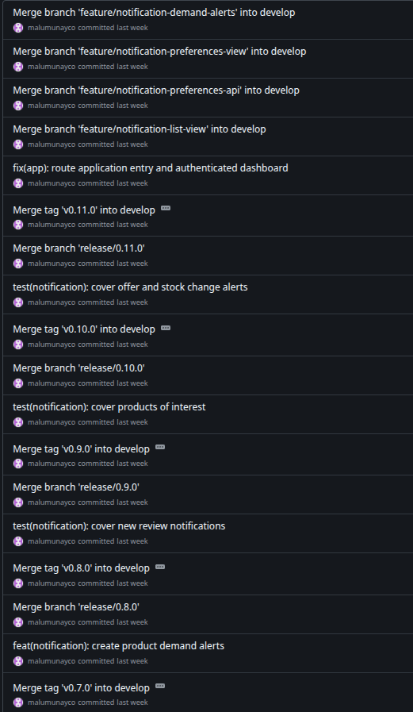{height=500px}

\newpage

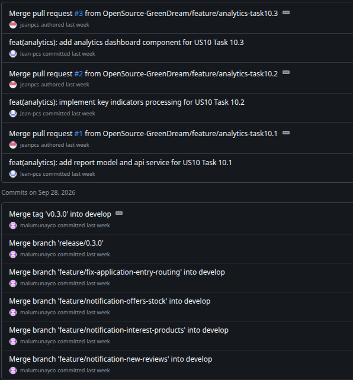{height=500px}

\newpage

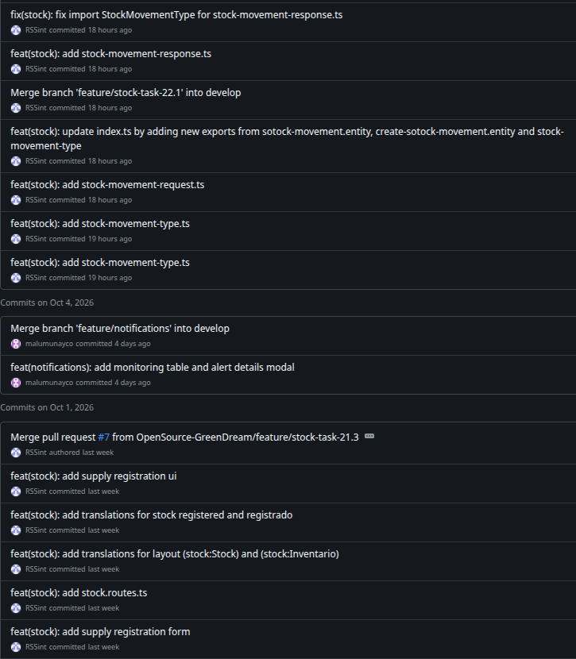{height=500px}

\newpage

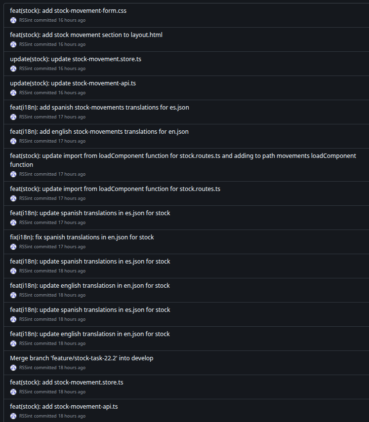{height=500px}

\newpage

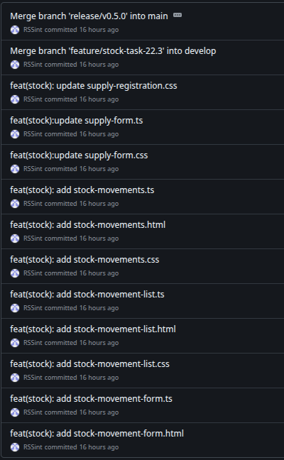{height=500px}

\newpage

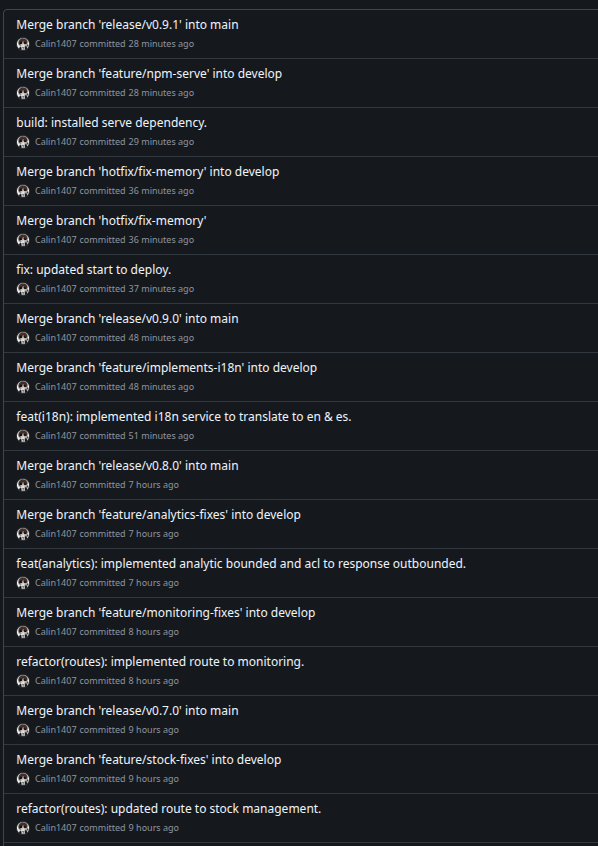{height=500px}

\newpage

## 5.2.2.5. Execution Evidence for Sprint Review

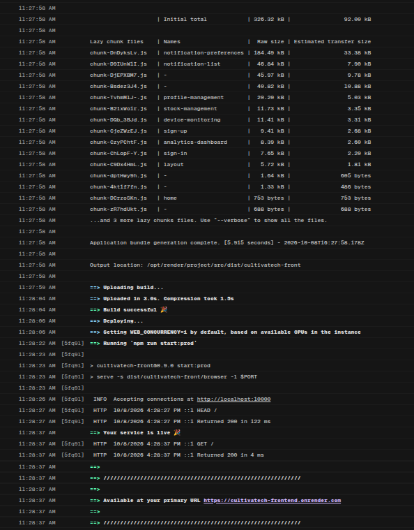{height=500px}

\newpage

## 5.2.2.6. Services Documentation Evidence for Sprint Review

Durante el sprint se elaboro el Front End para permitir al usuario
interactuar con la aplicacion web de CultivaTech.

Se siguieron practicas UX, responsive design y se preparo la pagina 
para traduccion multilengua y funcionalidades para desplazamiento 
eficiente. Asimismo, se integraron buenas practicas, Clean Architecture
y Domain Driven Design para la implementacion de los bounded contexts.

Se hace observacion que se usaron Mocks para la representacion de
informacion de los servicios Back End: Json server e ID Mock.
Esto permitio al equipo de desarrollo avanzar en la implementacion
del Front End sin depender de la implementacion de los servicios Back End.

* **Resumen de Logros**:
    * Avance del Front End (75%, pues se tiene una deuda tecnica a saldar en sprint 3).
    * Implementación completa de diseño responsivo, i18n, y redirecciones funcionales.
    * Consumo de servicios Back End mediante Mocks para la representacion de informacion.
    * Buenas practicas de Clean Architecture y Domain Driven Design para la implementacion de los bounded contexts.
    * Uso de patrones facade, request, response-resource, assembler y store.

\newpage

## 5.2.2.7. Software Deployment Evidence for Sprint Review

JSON Server Mock Up: [https://cultivatech-fakeapi.onrender.com/](https://cultivatech-fakeapi.onrender.com/)

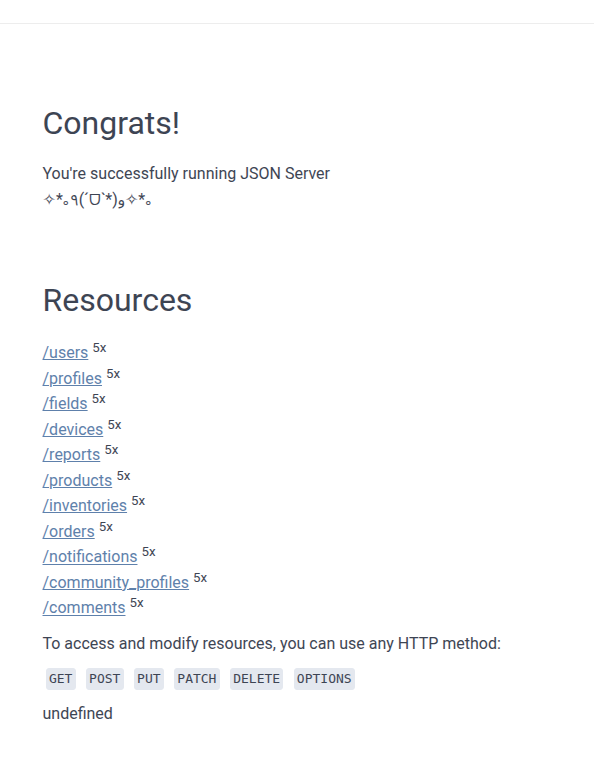{width=500px}

\newpage

Front End Deployment: [https://cultivatech-frontend.onrender.com/](https://cultivatech-frontend.onrender.com/)

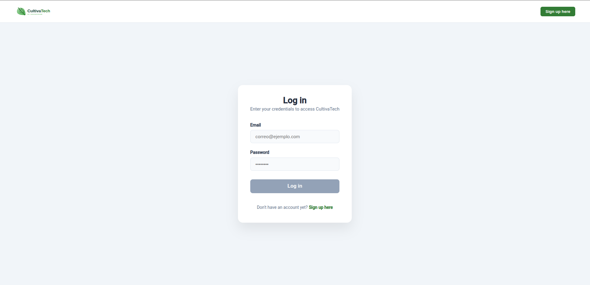{width=500px}

\newpage

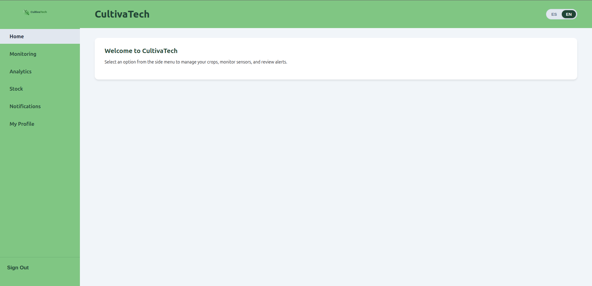{width=500px}

\newpage

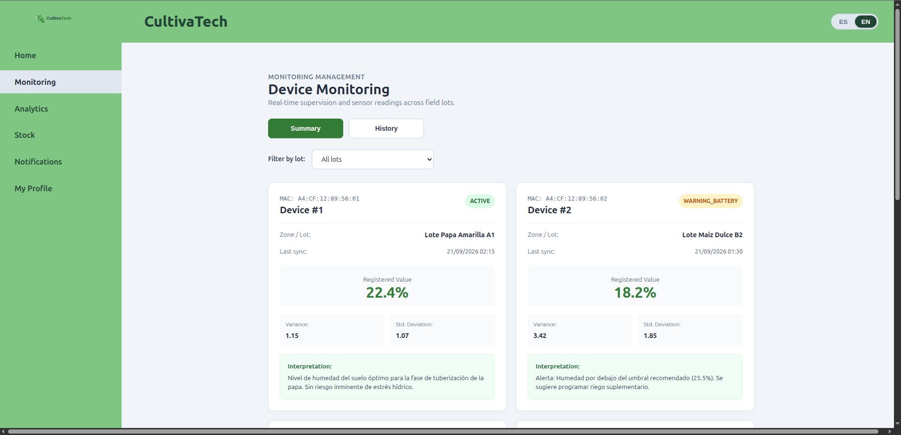{width=500px}

\newpage

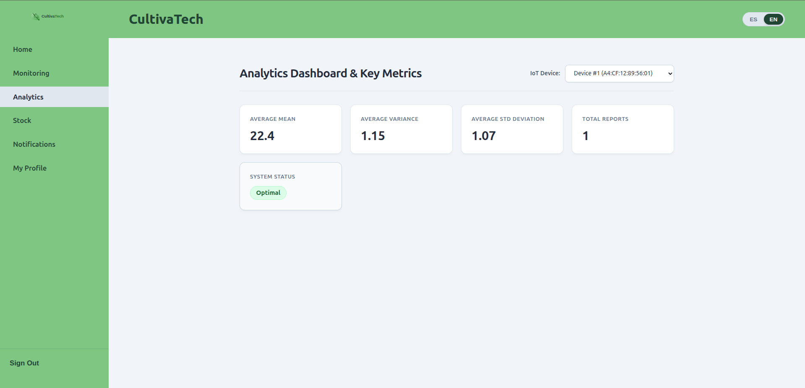{width=500px}

\newpage

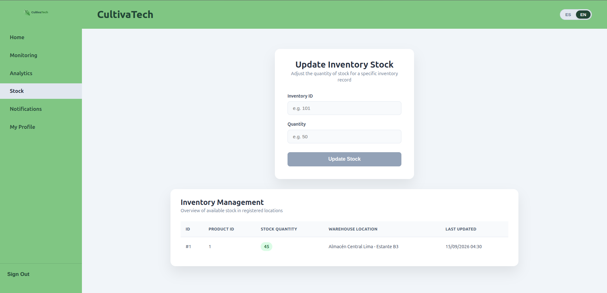{width=500px}

\newpage

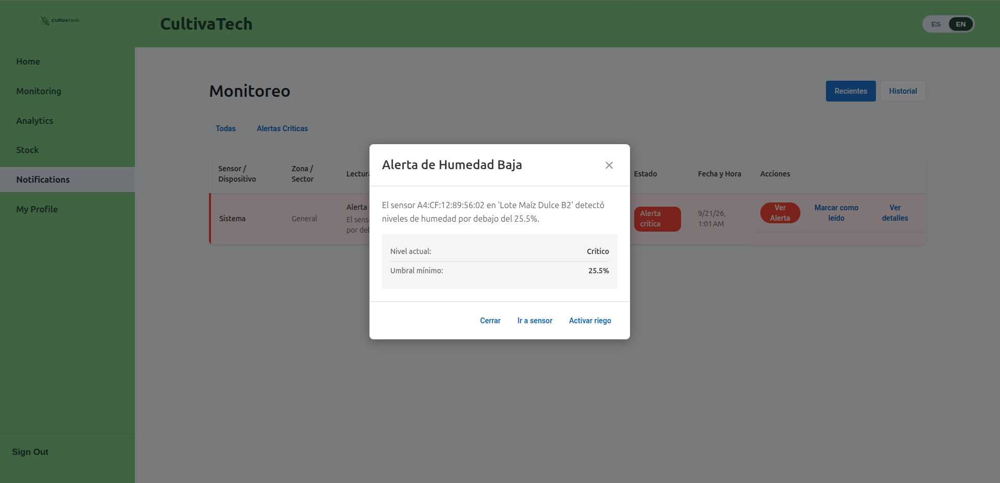{width=500px}

\newpage

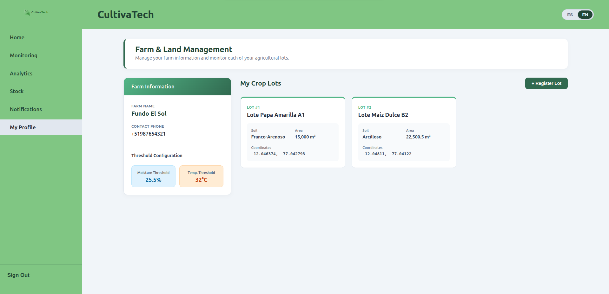{width=500px}

\newpage

## 5.2.2.8. Team Collaboration Insights during Sprint

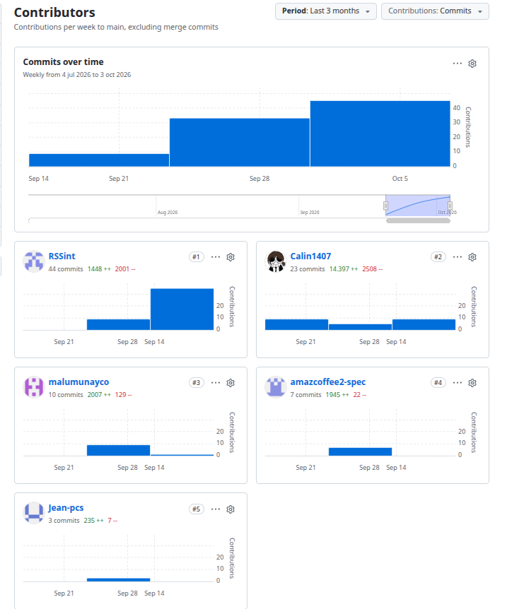{width=400px}

\newpage

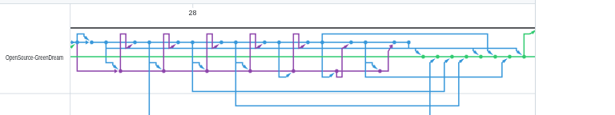{width=400px}

\newpage

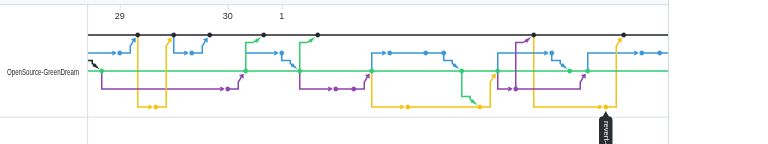{width=400px}

\newpage

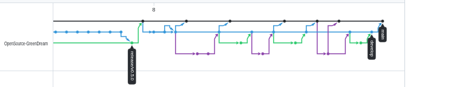{width=400px}

\newpage